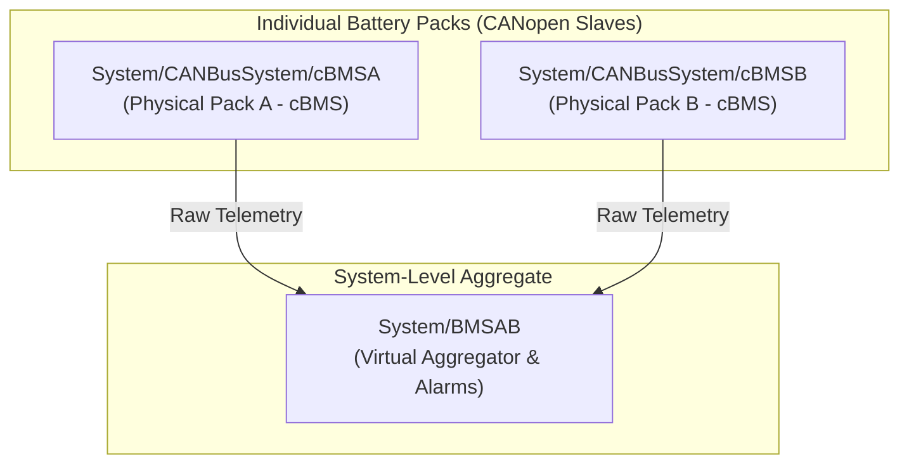

# CODESYS Basecode Battery Management System (BMS) Telemetry Signals Audit

This report presents a thorough, 100% verified audit of the CODESYS basecode to identify, document, and map all available monitoring signals for individual battery packs (**BMSA** and **BMSB**), as well as the system-level aggregate controller (**BMSAB**).

By analyzing the IEC 61131-3 source code inside [POU.export](file:///c:/local/opencode/codesys/exported-src/POU.export) and cross-checking the live variable tree from [plc_true_map.json](file:///C:/Users/technician/.gemini/antigravity/brain/221ed255-22b9-4c08-88a2-5f870ade149f/artifacts/plc_true_map.json), we have compiled the definitive telemetry registry for the battery system.

---

## 1. Battery System Telemetry Architecture

The battery management architecture on the crane is designed as a dual-layer hierarchy:



1. **Physical battery packs (`cBMSA` and `cBMSB`)**: 
   These are two identical physical battery packs connected as CANopen slaves. In CODESYS, they are configured as `cBMS` instances and initialized in the methods `mapBMSA` and `mapBMSB`. Their runtime paths are located under the system CAN bus system node:
   - `System/CANBusSystem/cBMSA/...`
   - `System/CANBusSystem/cBMSB/...`
2. **Aggregate battery system controller (`BMSAB`)**:
   This virtual controller handles the aggregation of pack parameters (summing currents, averaging voltages/SOC, tracking mismatches) and safety alarm dispatching. Its runtime paths are mapped under:
   - `System/BMSAB/...`

---

## 2. Basecode Initialization & Mappings

The initialization of the battery objects is defined in [POU.export](file:///c:/local/opencode/codesys/exported-src/POU.export) (lines 3656-3879 and 3892-4115). Both packs pass a identical set of **29 parameters** from CODESYS global variables to the battery management function blocks:

```iec
// Extracted from POU.export - mapBMSA / mapBMSB
lBMSA.initializeBMS(
    gBMSAGateway2PLCState1,            // State 1 from battery gateway
    gBMSAGateway2PLCState2,            // State 2 from battery gateway
    gBMSAPackCurrent,                  // Pack operational current
    gBMSAPackChargeCurrentLimit,        // Allowable charging current limit
    gBMSAPackDischargeCurrentLimit,     // Allowable discharging current limit
    gBMSAPackVoltage,                  // Pack voltage
    gBMSAPackAverageTemperature,       // Average cell temperature
    gBMSAPackMaxTemperature,           // Maximum cell temperature
    gBMSAPackMinTemperature,           // Minimum cell temperature
    gBMSAPackSOC,                      // Pack State of Charge (%)
    gBMSAPackSOH,                      // Pack State of Health (%)
    gBMSAPackChargingCurrentTarget,    // Target charging current requested by BMS
    gBMSAPackChargingVoltageTarget,    // Target charging voltage requested by BMS
    gBMSAPackCoolantTemperatureTarget, // Target coolant temperature requested by BMS
    gBMSAPackTotalChargeEnergyA,       // Charge energy accumulator segment A
    gBMSAPackTotalChargeEnergyB,       // Charge energy accumulator segment B
    gBMSAPackTotalChargeEnergyC,       // Charge energy accumulator segment C
    gBMSAPackTotalDischargeEnergyA,    // Discharge energy accumulator segment A
    gBMSAPackTotalDischargeEnergyB,    // Discharge energy accumulator segment B
    gBMSAPackTotalDischargeEnergyC,    // Discharge energy accumulator segment C
    gBMSAPackFaultNumber,              // Active fault number
    gBMSAPackFaultCode,                // Active fault code
    gBMSAPLC2GatewayState,             // Outbound state sent to battery gateway
    gBMSACoolantTemperature            // Current coolant temperature
);

lBMSA.Peripheral.initializePeripheral(
    gBMSAExternalState,                // External peripheral safety status
    gBMSASupplementaryCommand,         // Outbound control command to auxiliary components
    gBMSAInternalState,                // Internal peripheral state register
    gBMSAReportableState,              // Summary state reported to supervisor
    gBMSASupplementaryState            // Auxiliary peripheral status
);
```

---

## 3. Individual Pack Telemetry Register (BMSA & BMSB)

Below is the complete registry mapping the basecode parameters of `BMSA` and `BMSB` to their **verified live telemetry paths**. The paths use `/` separators and are verified active in the PLC tree:

| Parameter Name in Basecode | Verified Runtime Path (cBMSA shown; cBMSB is identical) | IEC Data Type | Recommended Metric | Operational Purpose / Description |
|---|---|---|---|---|
| `gBMSAPackCurrent` | `System/CANBusSystem/cBMSA/Current` | `ValObjReal` | `Metric250ms` | **Pack Current (A)**: Measures charging (negative) and discharging (positive) current. |
| `gBMSAPackVoltage` | `System/CANBusSystem/cBMSA/Voltage` | `ValObjReal` | `Metric250ms` | **Pack Voltage (V)**: Measures raw terminal voltage of the battery pack. |
| `gBMSAPackSOC` | `System/CANBusSystem/cBMSA/SOC` | `ValObjPercentage` | `Metric1s` | **State of Charge (%)**: Battery charge level remaining. |
| `gBMSAPackSOH` | `System/CANBusSystem/cBMSA/SOH` | `ValObjPercentage` | `Metric1h` | **State of Health (%)**: Wear level and cell capacity retention. |
| `gBMSAPackAverageTemperature` | `System/CANBusSystem/cBMSA/AverageTemp` | `ValObjReal` | `Metric5s` | **Average Cell Temp (°C)**: Mean cell temperature inside the pack. |
| `gBMSAPackMaxTemperature` | `System/CANBusSystem/cBMSA/MaxTemp` | `ValObjReal` | `Metric5s` | **Max Cell Temp (°C)**: Thermal hotspot check for safety interlocks. |
| `gBMSAPackMinTemperature` | `System/CANBusSystem/cBMSA/MinTemp` | `ValObjReal` | `Metric5s` | **Min Cell Temp (°C)**: Cold temperature protection threshold. |
| `gBMSACoolantTemperature` | `System/CANBusSystem/cBMSA/CurrCoolantTemp` | `ValObjReal` | `Metric5s` | **Coolant Temp (°C)**: Ingress liquid temperature for the cooling plates. |
| `gBMSAPackChargeCurrentLimit` | `System/CANBusSystem/cBMSA/ChrgCurrLmt` | `ValObjReal` | `Metric1s` | **Charge Current Limit (A)**: Maximum safe current the charger must not exceed. |
| `gBMSAPackDischargeCurrentLimit`| `System/CANBusSystem/cBMSA/DschrgCurrLmt` | `ValObjReal` | `Metric1s` | **Discharge Current Limit (A)**: Maximum safe load draw allowed by BMS. |
| `gBMSAPackChargingCurrentTarget`| `System/CANBusSystem/cBMSA/ChrgCurrTrgt` | `ValObjReal` | `Metric1s` | **Target Charge Current (A)**: Current requested by BMS from the charger. |
| `gBMSAPackChargingVoltageTarget`| `System/CANBusSystem/cBMSA/ChrgVoltTrgt` | `ValObjReal` | `Metric1s` | **Target Charge Voltage (V)**: Voltage requested by BMS from the charger. |
| `gBMSAPackCoolantTemperatureTarget`| `System/CANBusSystem/cBMSA/CoolantTempTrgt` | `ValObjReal` | `Metric5s` | **Target Coolant Temp (°C)**: Temp requested by BMS from the TMS chiller. |
| `gBMSAPackTotalChargeEnergy[A/B/C]`| `System/CANBusSystem/cBMSA/TtlChrgEnergy` | `ValObjReal` | `Metric1d` | **Total Charged Energy (kWh)**: Cumulative energy charged (Consolidated). |
| `gBMSAPackTotalDischargeEnergy[A/B/C]`| `System/CANBusSystem/cBMSA/TtlDschrgEnergy` | `ValObjReal` | `Metric1d` | **Total Discharged Energy (kWh)**: Cumulative energy drawn (Consolidated). |
| `gBMSAPackFaultNumber` | `System/CANBusSystem/cBMSA/FaultNumber` | `ValObjUSINT` | `Metric0ms` | **Active Fault Count**: Total count of active alarms inside the pack. |
| `gBMSAPackFaultCode` | `System/CANBusSystem/cBMSA/FaultCode` | `ValObjUSINT` | `Metric0ms` | **BMS Internal Fault Code**: Diagnostic fault code mapping to manual. |
| `gBMSAGateway2PLCState1` | `System/CANBusSystem/cBMSA/CurrBMSStt` | `ValObjEnum` | `Metric1s` | **Current BMS State**: Running state of the pack controller. |
| `gBMSAGateway2PLCState2` | `System/CANBusSystem/cBMSA/CurrBMSChrgStt` | `ValObjEnum` | `Metric1s` | **Current BMS Charge State**: Detailed charging cycle state. |
| `gBMSAPLC2GatewayState` | `System/CANBusSystem/cBMSA/ReqBMSStt` | `ValObjEnum` | `Metric1s` | **Requested BMS State**: Commanded state sent by the PLC to the pack. |
| `gBMSAInternalState` | `System/CANBusSystem/cBMSA/state` | `Alarm` | `Metric0ms` | **Summary Alarm Status**: Main alarm register for pack health. |

### Auxiliary CAN Bus & Safety States (Hardware Layer)
In addition to the operational variables mapped in the methods, the system registers the following **hardware-level status registers** for each pack:

* **`System/CANBusSystem/cBMSA/SlaveMod` (`SgnMod`)**: CANopen slave node status (Operational, Pre-operational, Fault).
* **`System/CANBusSystem/cBMSA/RqstDisconnect` (`ValObjBool`)**: Request from BMS to disconnect contactors immediately due to safety trip.
* **`System/CANBusSystem/cBMSA/Balancing` (`ValObjBool`)**: Active cell balancing indicator (passive dissipators active).
* **`System/CANBusSystem/cBMSA/FaultCharger` (`ValObjBool`)**: Trip flag indicating charger communications or hardware fault.
* **`System/CANBusSystem/cBMSA/FaultContactor` (`ValObjBool`)**: Trip flag indicating battery terminal contactor welds/failures.
* **`System/CANBusSystem/cBMSA/FaultLevel` (`ValObjEnum`)**: Severity of the active battery fault (0 = Safe, 1 = Warning, 2 = Critical shutdown).

---

## 4. Aggregate Battery System Telemetry (`System/BMSAB`)

The virtual aggregate controller is accessible under `System/BMSAB/`. It calculates comparative differences and sets safety limits for the combined batteries:

| Signal Name | Runtime Path | Data Type | Purpose |
|---|---|---|---|
| **System Current** | `System/BMSAB/Current` | `ValRefReal` | **Aggregate Current (A)**: Combined load current from both packs. |
| **System Voltage** | `System/BMSAB/Voltage` | `ValRefReal` | **Combined Battery Voltage (V)**: Measured voltage at the DC bus link. |
| **System SOC** | `System/BMSAB/SOC` | `ValRefPercentage` | **System State of Charge (%)**: Weighted average of the remaining energy. |
| **BMS Availability** | `System/BMSAB/Availability` | `ValRefPercentage` | **System Availability Factor (%)**: Fraction of active battery modules online. |
| **Voltage Mismatch** | `System/BMSAB/VoltageMismatch` | `ValRefPersReal` | **Voltage Delta (V)**: Voltage difference between Pack A and Pack B. |
| **SOC Mismatch** | `System/BMSAB/SOCMismatch` | `ValRefPersReal` | **SOC Delta (%)**: State of charge difference between packs. |
| **Current Mismatch** | `System/BMSAB/CurrentMismatch` | `ValRefPersReal` | **Current Delta (A)**: Disproportionate current sharing between packs. |
| **System BMS Enable** | `System/BMSAB/EnblBMS` | `ValRefPersUINT` | **BMS Master Switch**: Command to activate or bypass battery systems. |
| **BMS Restart Count** | `System/BMSAB/RestartCount` | `ValRefUSINT` | **Auto-Recovery Counter**: Tracks contactor restart attempts after trips. |
| **Low SOC Shutdown** | `System/BMSAB/SOCLowOpMin` | `SysCntrl` | **Critical Low SOC**: Triggers vehicle emergency halt to protect cell chemistry. |
| **Low SOC Standby** | `System/BMSAB/SOCLowStdbyMin` | `Alarm` | **Standby Low SOC**: Restricts auxiliary functions to conserve charge. |
| **BMS Disconnect Block**| `System/BMSAB/DsblConnect` | `ValRefBool` | **Contactor Lockout**: Hard block preventing re-closing of battery contacts. |

### Aggregate Safety Alarms (`BMSAB` Alarms)
These alarms represent safety thresholds that trip if the battery packs drift out of sync:

* **`System/BMSAB/BMSSOCMismatch` (`EscAlarm`)**: Latches if the SOC difference between the two packs exceeds the allowed limit, indicating cell degradation in one pack.
* **`System/BMSAB/BMSVoltMismatch` (`EscAlarm`)**: Latches if the voltage difference is too high, preventing parallel connection to avoid massive circulating currents.
* **`System/BMSAB/BMSCurrMismatch` (`EscAlarm`)**: Latches if one battery pack is taking significantly more load than the other (unequal resistance).
* **`System/BMSAB/BMSNotConnect` (`Alarm`)**: Active if communication to one of the battery packs is completely lost on the CAN bus.
* **`System/BMSAB/TMSMismatch` (`EscAlarm`)**: Liquid cooling differential temperature fault between the battery packs.
* **`System/BMSAB/BMSChrgCutb` (`ChargeMod`)**: Active if battery temperature limits or cell voltages require cutting back the charging current.
* **`System/BMSAB/BMSDischCutb` (`ChargeMod`)**: Active if battery limits require limiting maximum travel or hoist draw current (power limiting).

---

## 5. Implementation Guide: Measuring Profile Integration

To enable monitoring of the individual battery packs (`BMSA` and `BMSB`) instead of only aggregate values, the user can integrate these newly audited signals into **`MP-03_Battery_Medium_Consumption`**. 

Below is the recommended JSON schema block to extend [MP-03.json](file:///c:/local/opencode/codesys/report/measuring-profile/MP-03.json) and [MP-03-verified-signals.json](file:///c:/local/opencode/codesys/exports/measuring-profiles/MP-03-verified-signals.json):

```json
{
  "template_signal": "bms_a_current",
  "signal_name": "bms_a_current",
  "runtime_path": "System/CANBusSystem/cBMSA/Current",
  "metric": "Metric250ms",
  "status": "present",
  "evidence": "Audited in CODESYS basecode POU.export mapBMSA and verified in flat_map."
},
{
  "template_signal": "bms_a_voltage",
  "signal_name": "bms_a_voltage",
  "runtime_path": "System/CANBusSystem/cBMSA/Voltage",
  "metric": "Metric250ms",
  "status": "present",
  "evidence": "Audited in CODESYS basecode POU.export mapBMSA and verified in flat_map."
},
{
  "template_signal": "bms_a_soc",
  "signal_name": "bms_a_soc",
  "runtime_path": "System/CANBusSystem/cBMSA/SOC",
  "metric": "Metric1s",
  "status": "present",
  "evidence": "Audited in CODESYS basecode POU.export mapBMSA and verified in flat_map."
},
{
  "template_signal": "bms_a_max_temp",
  "signal_name": "bms_a_max_temp",
  "runtime_path": "System/CANBusSystem/cBMSA/MaxTemp",
  "metric": "Metric5s",
  "status": "present",
  "evidence": "Audited in CODESYS basecode POU.export mapBMSA and verified in flat_map."
},
{
  "template_signal": "bms_b_current",
  "signal_name": "bms_b_current",
  "runtime_path": "System/CANBusSystem/cBMSB/Current",
  "metric": "Metric250ms",
  "status": "present",
  "evidence": "Audited in CODESYS basecode POU.export mapBMSB and verified in flat_map."
},
{
  "template_signal": "bms_b_voltage",
  "signal_name": "bms_b_voltage",
  "runtime_path": "System/CANBusSystem/cBMSB/Voltage",
  "metric": "Metric250ms",
  "status": "present",
  "evidence": "Audited in CODESYS basecode POU.export mapBMSB and verified in flat_map."
},
{
  "template_signal": "bms_b_soc",
  "signal_name": "bms_b_soc",
  "runtime_path": "System/CANBusSystem/cBMSB/SOC",
  "metric": "Metric1s",
  "status": "present",
  "evidence": "Audited in CODESYS basecode POU.export mapBMSB and verified in flat_map."
},
{
  "template_signal": "bms_b_max_temp",
  "signal_name": "bms_b_max_temp",
  "runtime_path": "System/CANBusSystem/cBMSB/MaxTemp",
  "metric": "Metric5s",
  "status": "present",
  "evidence": "Audited in CODESYS basecode POU.export mapBMSB and verified in flat_map."
}
```

By adding these parameters, the telemetry platform will record the voltage and current balance between the two physical packs at **250ms high speed**, capturing dynamic battery draw profiles during load lifts and peak acceleration bursts.
