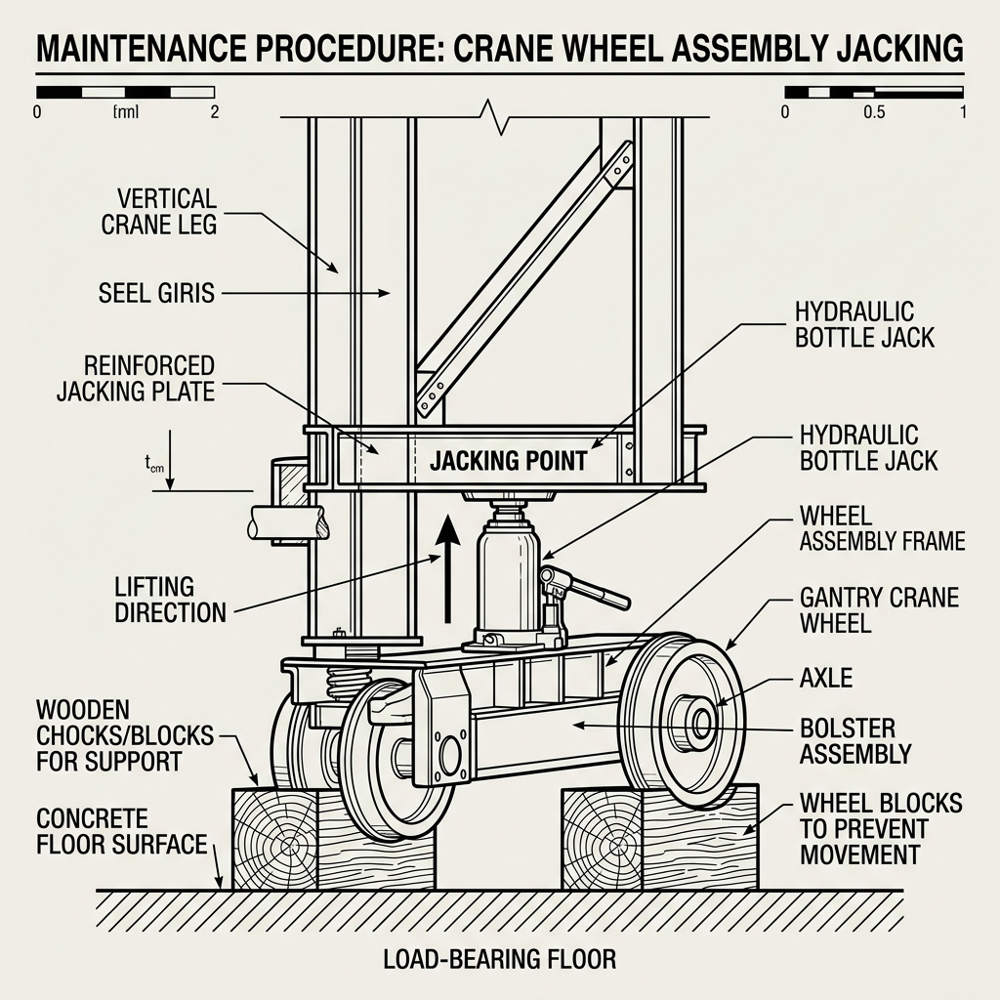

# Travel Drive C Motor Replacement Procedure

| Project | Isoloader MJ35 Gantry Crane Performance & Maintenance |
| :--- | :--- |
| **Component** | Travel Drive C Motor (`transC`) |
| **Author** | Antigravity AI & Maintenance Team |
| **Target Audience** | Rob, Thang Ma & Maintenance Technicians |
| **Date** | June 24, 2026 |

---

## 1. Safety Prerequisites & Isolation
> [!IMPORTANT]
> **Safety First:**
> Ensure the machine is in a completely safe, de-energized state before performing any mechanical or electrical maintenance.

*   **Machine State:** Ensure the Isoloader MJ35 Gantry Crane is in **Standby** state.
*   **Emergency Stop:** Press the **Emergency Stop** (E-Stop) button on the operator console.
*   **Electrical Isolation:** Disconnect the main battery pack and switch the battery isolator switch to the OFF position (battery turn off). Verify that the control panel is completely powered down.

---

## 2. Jacking up the Chassis & Wheel Removal
*   **Wheel Chocking:** Place heavy-duty wooden chocks or blocks under the other wheels to prevent any unexpected movement, especially if the machine is parked on a slope.
*   **Jacking Up:** Position a hydraulic bottle jack under the designated jacking point on the chassis frame near the Travel Drive C wheel assembly. Jack up the crane until the wheel is completely clear of the ground.
*   **Wheel Removal:** Loosen and remove the wheel nuts, then carefully slide the wheel off the hub assembly.

### Jacking Point Reference

---

## 3. Disconnecting Power & Control Lines
Before unmounting the motor, carefully disconnect the following lines from the motor body:

1.  **Main Power Cables:** Disconnect the high-current power cables supplying electrical energy to the motor phases. Tag and label each cable (U, V, W) to ensure correct phase reconnection later.
2.  **Speed Sensor Cable:** Disconnect the encoder / speed feedback sensor connector.
3.  **Temperature Sensor Cable:** Disconnect the internal motor temperature sensor connector.
4.  **Hydraulic Brake Line:** Disconnect the hydraulic line supplying oil pressure to release the integrated motor brake.

> [!WARNING]
> **Fluid Spillage & Contamination:**
> Plug all disconnected hydraulic ports and lines immediately to prevent hydraulic fluid spillage, oil loss, and to protect the system from contamination by dust and particulate matter.

---

## 4. Motor Replacement
*   **Unmounting:** Support the weight of the motor using a crane or hoist. Remove the mounting bolts connecting the motor to the planetary gear hub. Carefully slide the motor out.
*   **Mounting New Motor:** Inspect and clean the mounting flange and the spline shaft. Apply a thin layer of grease to the splines. Slide the new motor in, aligning the splines, and torque the mounting bolts to the manufacturer's specifications in a cross pattern.
*   **Reconnection:** Reconnect all electrical power phases (matching the labeled U, V, W phases), the speed sensor plug, the temperature sensor plug, and the hydraulic brake line.

---

## 5. Controller Calibration
> [!NOTE]
> **Responsible Person:** **Thang Ma**
> This calibration step is crucial to prevent load imbalance and must be performed by Thang Ma.

After replacing the motor, the new motor must be calibrated with the Zapi controller (ACE4/FOC3) to ensure proper operation, correct speed scaling, and to avoid load imbalance.

*   Reconnect the battery and turn the battery isolator switch to the ON position.
*   Release the Emergency Stop button.
*   Connect the Zapi Handheld Console or PC diagnostic tool to the motor controller (Zapi ACE4/FOC3).
*   Trigger the motor self-characterization and calibration routine to align the controller with the new motor's electrical constants.
*   Verify that current, speed scaling, and estimated torque parameters read correctly and match the manufacturer's specifications.

---

## 6. Hydraulic Brake System Bleeding
To ensure the hydraulic brake operates correctly, any air trapped in the line during disconnection must be bled.

> [!CAUTION]
> **Runaway Hazard:**
> Before releasing the brake for bleeding, double-check that the wheels are securely chocked with wooden blocks. Opening the brakes on an incline without chocks will cause the machine to roll out of control.

*   Activate the manual brake release function via the software/controller interface to supply hydraulic pressure and open the mechanical brake.
*   Locate the bleed valve on the brake caliper. Open the valve to allow trapped air to escape from the line. Close the valve once a steady stream of oil flows out without any air bubbles.
*   Verify the brake fluid level in the hydraulic reservoir and top it up to the recommended level if necessary.

---

## 7. Reassembly & Lowering
*   **Wheel Installation:** Lift and position the wheel back onto the hub. Install the wheel nuts and tighten them by hand.
*   **Lowering the Jack:** Slowly and carefully release the hydraulic pressure on the bottle jack to lower the machine until the wheel is resting on the ground. Remove the jack.
*   **Final Torquing:** Use a torque wrench to tighten the wheel nuts to the specified torque rating in a diagonal star pattern to ensure even load distribution.
*   **Remove Chocks:** Remove all wooden chocks/blocks from under the wheels.

---

## 8. Verification & Test Run
*   **Visual Inspection:** Double check all connections, ensuring that no tools or loose parts are left inside the motor compartment or on the wheel assembly.
*   **Slow Speed Test:** Perform a slow-speed test drive forward and reverse. Listen for abnormal noises and check for any vibrations.
*   **Telemetry Monitoring:** Observe the telemetry logs for `transC`. Verify that the DC bus current, estimated torque, and motor temperature remain stable and balanced compared to the other travel drives (`transA`, `transB`, `transD`).
