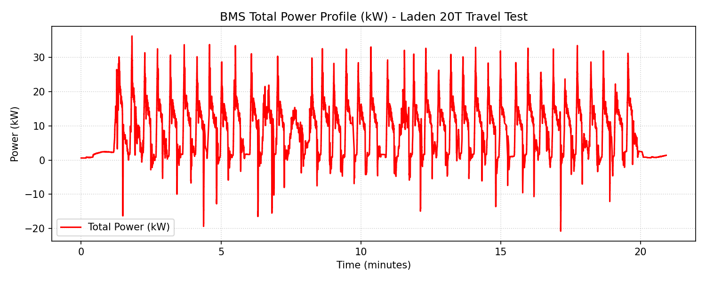
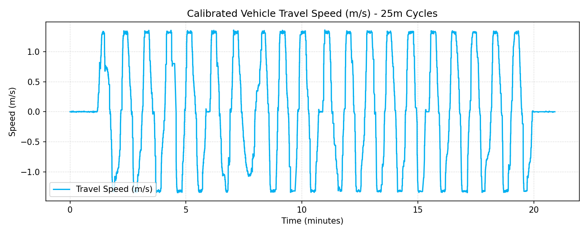
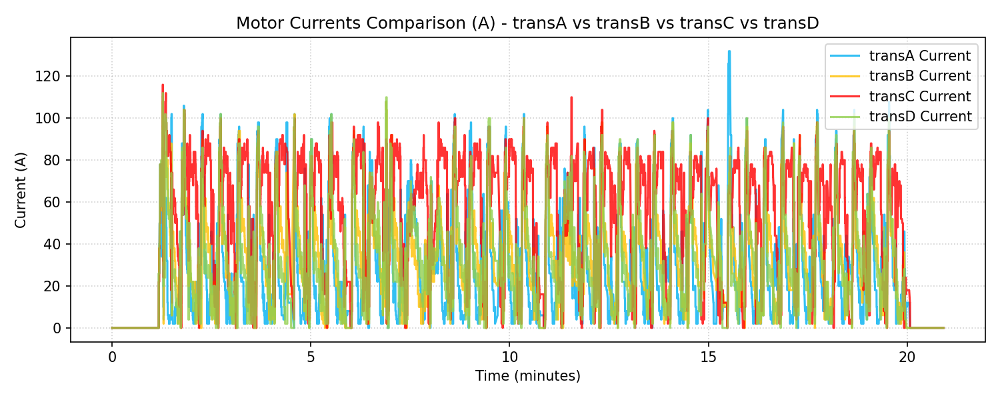
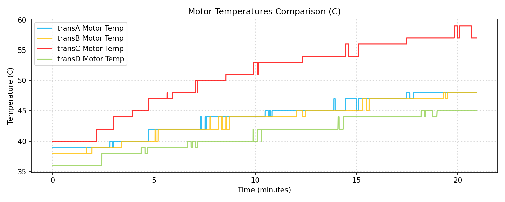

# BMS Laden Travel Test Performance Report (20T Load)

**Document Reference:** BMS-REPORT-LOAD-HVAC-ON
**Vehicle Model:** Isoloader MJ35 Gantry Crane
**Battery Configuration:** CATL 130 VDC Nominal (114.52 kWh Total)
**Test Configuration:** Laden Travel (Có tải 20 tấn), HVAC ON
**Test Method:** 25m forward + 25m backward cycles, total 40 times (target 1.0 km)
**Test Location:** try1 Folder

---

## 1. Executive Summary
- **Average Combined Power (with HVAC ON):** **8.5211 kW**
- **Total Distance Traveled:** **993.61 meters (0.9936 km)**
- **Total Energy Consumed during Test:** **2.9513 kWh**
- **Combined Energy Consumption Rate:** **2.9703 kWh/km**
- **Standby/HVAC Power baseline:** **1.8426 kW**
- **Net Traction-only Energy Consumption Rate:** **2.3239 kWh/km**
- **Maximum Vehicle Speed:** **4.90 km/h** (3.04 mile/h) [Speed in m/s: 1.36 m/s]
- **Projected Continuous Runtime (80% Battery Capacity - 91.62 kWh):** **10.75 Hours** (10 giờ 45 phút)

---

## 2. Motor Balance & Anomaly Analysis (Moving)

| Parameter / Metric | Drive A (transA) | Drive B (transB) | Drive C (transC) | Drive D (transD) |
|---|---|---|---|---|
| **Average Current (A)** | 30.95 A | 37.16 A | **67.45 A** | 35.73 A |
| **Maximum Current (A)** | 132.00 A | 108.00 A | **116.00 A** | 112.00 A |
| **Mean Absolute Torque (Nm)** | 13.65 Nm | 15.22 Nm | **29.76 Nm** | 14.19 Nm |
| **Mean Motor Temp (°C)** | 43.7 °C | 43.2 °C | **50.5 °C** | 40.8 °C |
| **Maximum Motor Temp (°C)** | 48.0 °C | 48.0 °C | **59.0 °C** | 45.0 °C |

> [!WARNING]
> **Persistent transC Loading Anomaly:**
> - `transC` draws an average current of **67.45 A** and outputs **29.76 Nm** of torque, which is **more than double** the load of the other drives (e.g. transA draws 30.95 A and outputs 13.65 Nm).
> - This causes the motor C temperature to reach **59.0°C** and increases energy losses significantly. This confirms the dragging/binding brake diagnosis on wheel C has not been resolved.

---

## 3. Data Plots and Visualization

### 3.1 Power Profile (kW)

### 3.2 Calibrated Travel Speed (m/s)

### 3.3 Motor Currents Comparison (A)

### 3.4 Motor Temperatures Comparison (°C)

---

## 4. Engineering Recommendations & Verdict
1. **Urgent Brake Inspection on Wheel C:** The persistent overload on `transC` (twice the torque of other wheels) is a major mechanical risk. It is highly recommended to physically inspect the hydraulic release brake caliper on wheel C. Check for brake drag, pad rubbing, or sticking pistons.
2. **Speed-Torque Profile Verification:** The maximum speed of **4.90 km/h** under 20T load satisfies the variable speed load spec (Variable to 6 km/h).
3. **80% Battery Life:** Under this continuous 20T laden travel intensity, the 80% battery capacity will sustain the machine for **10.75 hours** (10 giờ 45 phút).
