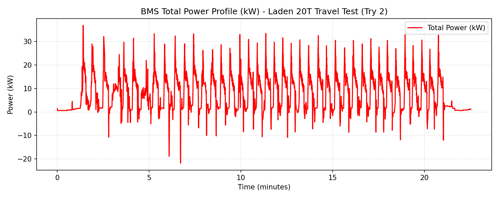
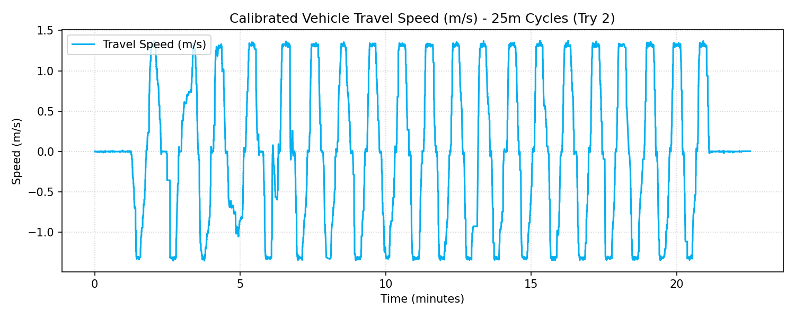
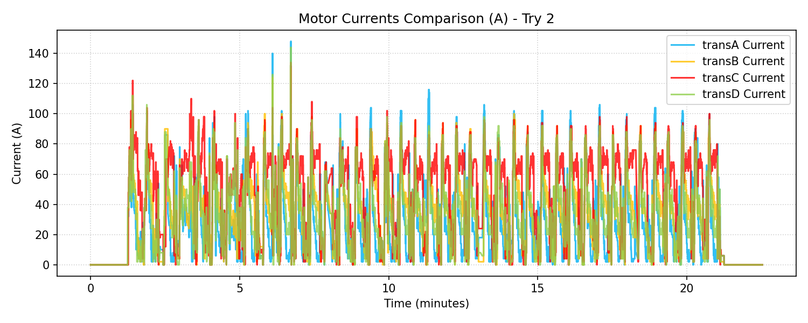
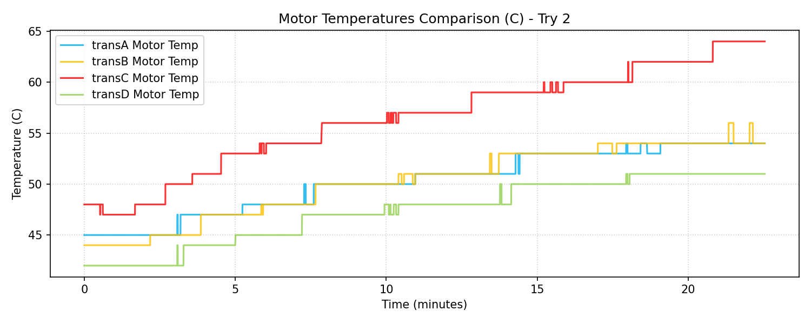

# BMS Laden Travel Test Performance Report (20T Load) - Try 2

**Document Reference:** BMS-REPORT-LOAD-HVAC-ON-TRY2
**Vehicle Model:** Isoloader MJ35 Gantry Crane
**Battery Configuration:** CATL 130 VDC Nominal (114.52 kWh Total)
**Test Configuration:** Laden Travel (Có tải 20 tấn), HVAC ON (Lần 2)
**Test Method:** 25m forward + 25m backward cycles, total 40 times (target 1.0 km)
**Test Location:** try2 Folder

---

## 1. Executive Summary
- **Average Combined Power (with HVAC ON):** **7.8766 kW**
- **Total Distance Traveled:** **1012.81 meters (1.0128 km)**
- **Total Energy Consumed during Test:** **2.9862 kWh**
- **Combined Energy Consumption Rate:** **2.9485 kWh/km**
- **Standby/HVAC Power baseline:** **1.6358 kW**
- **Net Traction-only Energy Consumption Rate:** **2.3420 kWh/km**
- **Maximum Vehicle Speed:** **4.94 km/h** (3.07 mile/h) [Speed in m/s: 1.37 m/s]
- **Projected Continuous Runtime (80% Battery Capacity - 91.62 kWh):** **11.63 Hours** (11 giờ 37 phút)

---

## 2. Motor Balance & Anomaly Analysis (Moving)

| Parameter / Metric | Drive A (transA) | Drive B (transB) | Drive C (transC) | Drive D (transD) |
|---|---|---|---|---|
| **Average Current (A)** | 29.91 A | 39.87 A | **57.78 A** | 36.63 A |
| **Maximum Current (A)** | 140.00 A | 130.00 A | **128.00 A** | 136.00 A |
| **Mean Absolute Torque (Nm)** | 12.02 Nm | 15.16 Nm | **25.24 Nm** | 13.94 Nm |
| **Mean Motor Temp (°C)** | 50.4 °C | 50.4 °C | **56.7 °C** | 47.6 °C |
| **Maximum Motor Temp (°C)** | 54.0 °C | 54.0 °C | **64.0 °C** | 51.0 °C |

> [!WARNING]
> **Persistent transC Loading Anomaly (Confirmed in Try 2):**
> - In this second laden run, `transC` still draws an average current of **57.78 A** and outputs **25.24 Nm** of torque, which is **nearly double** the load of the other drives (e.g. transA draws 29.91 A and outputs 12.02 Nm).
> - This causes the motor C temperature to reach **64.0°C** (higher than Try 1's 59.0°C).
> - This confirms that the dragging/binding brake diagnosis on wheel C is persistent and needs physical intervention.

---

## 3. Data Plots and Visualization

### 3.1 Power Profile (kW)

### 3.2 Calibrated Travel Speed (m/s)

### 3.3 Motor Currents Comparison (A)

### 3.4 Motor Temperatures Comparison (°C)

---

## 4. Engineering Recommendations & Verdict
1. **Urgent Brake Inspection on Wheel C:** The persistent overload on `transC` is confirmed across multiple tests. Motor temperatures reaching **64.0°C** indicate high mechanical friction. It is highly recommended to physically inspect the hydraulic release brake caliper on wheel C.
2. **Speed-Torque Profile Verification:** The maximum speed of **4.94 km/h** under 20T load satisfies the variable speed load spec.
3. **80% Battery Life:** Under this continuous 20T laden travel intensity, the 80% battery capacity will sustain the machine for **11.63 hours** (11 giờ 37 phút).
