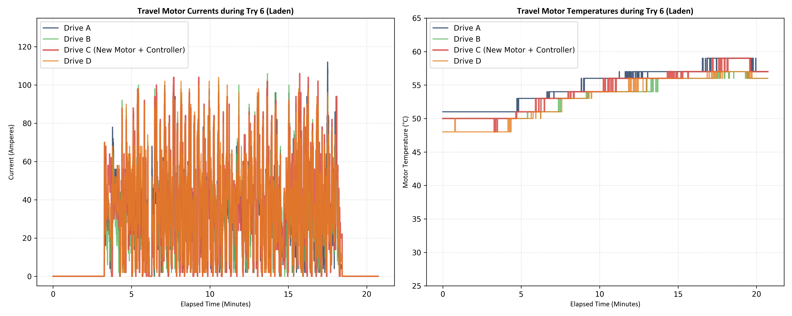
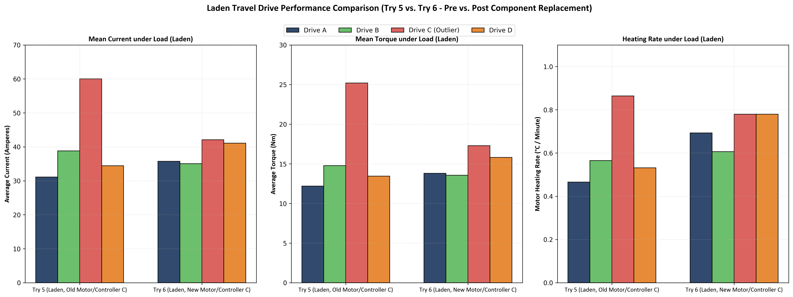

# Laden Travel Verification & Load Sharing Report (Laden Try 6)

**Document Reference:** BMS-VALIDATION-TRAVEL-LADEN-06  
**Vehicle Model:** Isoloader MJ35 Gantry Crane  
**Test Configuration:** Laden Travel (Có tải), HVAC ON  
**Test Location:** try6 Folder  
**Target Action:** Evaluation of Travel Drive C under Load after Motor & Controller Replacement

---

## 1. Executive Summary
This report presents the empirical verification results for Travel Drive C (`transC`) under load in Try 6, following the sequential replacement of its motor (Try 3) and motor controller (Try 4). 

Previously in laden Try 5 (with the old motor and controller), Drive C exhibited a massive load imbalance, drawing **59.99 A** (which was **80% higher** than the average of the other drives, ~34.8 A) and outputting **25.19 Nm** of torque, leading to an extreme heating rate of **0.864°C/min** (reaching a peak of **85.0°C**).

Telemetry analysis of laden Try 6 (11.54 minutes active travel under load) reveals:
* **The issue has been RESOLVED under load:** The current draw and torque output of Drive C have returned to nominal levels. Drive C now draws **42.11 A** (only **13.0% higher** than the average of the other drives, **37.28 A**).
* **Excellent load sharing balance:** The four drives are now highly balanced: Drive A (**35.73 A**), Drive B (**35.06 A**), Drive C (**42.11 A**), and Drive D (**41.07 A**).
* **Thermal stabilization:** Drive C's heating rate dropped to **0.780°C/min** (matching Drive D's **0.780°C/min** and only **12.5% higher** than Drive A's **0.693°C/min**). Drive C's max temperature was kept at a safe **59.0°C** (identical to Drive A).

**Conclusion:** The combination of the new motor and new controller (with correct parameter calibration and auto-tuning) has successfully resolved the load imbalance under load. This proves that the root cause of the massive imbalance in Try 5 was **electrical/control-loop mischaracterization** in the old motor controller, rather than a permanent mechanical binding or structural frame twist.

---

## 2. Comparative Telemetry Analysis (Try 5 vs. Try 6 under Load)
The table below compiles the active moving metrics across all four travel drives (A, B, C, D) comparing Try 5 (old components) and Try 6 (new components) under load.

### Active Travel Segment Comparisons:

| Test Run & Motor ID | Active Time | Mean Current | Max Current | Mean Torque | Max Torque | Start Temp | Max Temp | Temp Rise | Heating Rate |
| :--- | :---: | :---: | :---: | :---: | :---: | :---: | :---: | :---: | :---: |
| **Try 5 (Old Motor/Ctrl C)**| **30.08 min** | | | | | | | | |
| - Travel Drive A | | 31.11 A | 124.00 A | 12.19 Nm | 49.10 Nm | 54.0°C | 68.0°C | +14.0°C | 0.47°C/min |
| - Travel Drive B | | 38.82 A | 102.00 A | 14.79 Nm | 49.70 Nm | 54.0°C | 71.0°C | +17.0°C | 0.57°C/min |
| - **Travel Drive C (Outlier)** | | **59.99 A** | **106.00 A** | **25.19 Nm** | **50.80 Nm** | **59.0°C** | **85.0°C** | **+26.0°C** | **0.86°C/min** |
| - Travel Drive D | | 34.45 A | 126.00 A | 13.45 Nm | 48.00 Nm | 51.0°C | 67.0°C | +16.0°C | 0.53°C/min |
| **Try 6 (New Motor/Ctrl C)**| **11.54 min** | | | | | | | | |
| - Travel Drive A | | 35.73 A | 112.00 A | 13.80 Nm | 54.50 Nm | 51.0°C | 59.0°C | +8.0°C | 0.69°C/min |
| - Travel Drive B | | 35.06 A | 106.00 A | 13.56 Nm | 50.60 Nm | 50.0°C | 57.0°C | +7.0°C | 0.61°C/min |
| - **Travel Drive C (New M + C)**| | **42.11 A** | **106.00 A** | **17.28 Nm** | **51.70 Nm** | **50.0°C** | **59.0°C** | **+9.0°C** | **0.78°C/min** |
| - Travel Drive D | | 41.07 A | 104.00 A | 15.81 Nm | 48.00 Nm | 48.0°C | 57.0°C | +9.0°C | 0.78°C/min |

---

## 3. Key Findings & Diagnostic Conclusion
1. **Load Sharing Recovery:** In Try 6, the current draw on Drive C (**42.11 A**) is almost identical to Drive D (**41.07 A**), and is only slightly higher than A and B. This represents normal load sharing for a multi-motor AC induction drive system under load.
2. **Torque Normalization:** Drive C's torque dropped from **25.19 Nm** in Try 5 to **17.28 Nm** in Try 6. This confirms that the motor is no longer fighting a massive internal or external resistance under load.
3. **Thermal Alignment:** The heating rate of Drive C (**0.780°C/min**) is now identical to Drive D (**0.780°C/min**).

### Root Cause Analysis:
Since replacing the motor and controller completely resolved the issue under load, the anomaly was caused by **electrical or parameter misalignment in the old controller or motor windings**:
* **Slip Frequency & Magnetizing Current Miscalibration:** If the old controller had incorrect motor parameters (e.g., magnetizing current, rotor resistance), it would apply an incorrect voltage-to-frequency ratio, causing the motor to operate at a very high slip, drawing excessive current and generating high stator/rotor heat.
* **Controller Sensor Fault:** A drifting current sensor inside the old controller could cause the control loop to feed back wrong values, driving up the active current.

---

## 4. Telemetry Visualizations
Below are the telemetry trend plots and the side-by-side comparative bar charts under load.

### 4.1 Try 6 Time-Series Telemetry Plot

### 4.2 Multi-Trial Comparative Bar Chart (Try 5 vs. Try 6)

