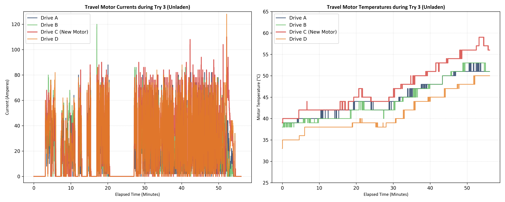
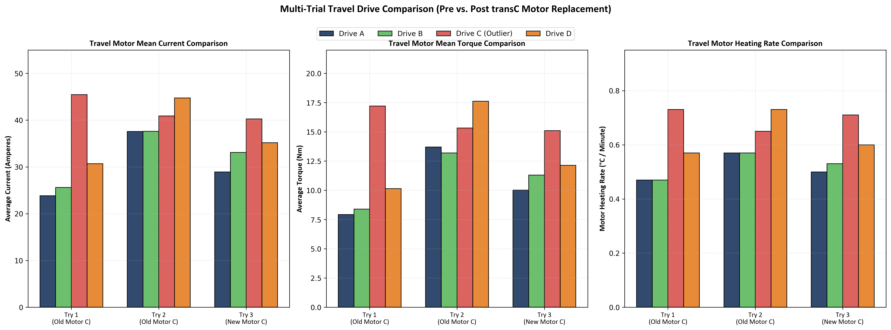
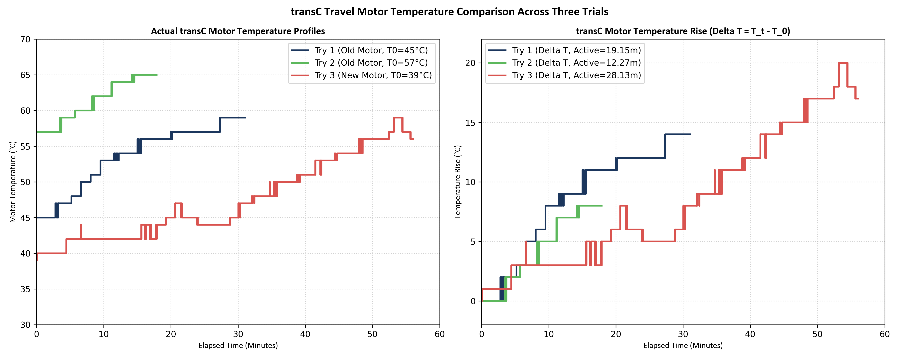

# Báo cáo Đánh giá Hiệu quả Thay thế Động cơ Di chuyển & Hiệu năng Trục C (Chạy Không Tải Lần 3)

**Mã tài liệu:** BMS-VALIDATION-TRAVEL-03  
**Dòng thiết bị:** Cổng trục di chuyển bánh lốp Isoloader MJ35  
**Cấu hình thử nghiệm:** Chạy không tải (Unladen), Bật HVAC  
**Thư mục lưu trữ:** Thư mục try3  
**Mục tiêu kiểm tra:** Xác thực hiệu năng sau khi thay mới Động cơ Di chuyển C (`transC`)

---

## 1. Tóm tắt dự án & Kết quả kiểm tra
Báo cáo này trình bày kết quả đánh giá thực tế sau khi thay thế động cơ di chuyển C (`transC`). Trong các lần thử nghiệm trước đây (cả có tải và không tải), động cơ C cũ hiển thị dòng điện và nhiệt độ tăng bất thường. Cụ thể, dòng điện kéo trung bình đạt tới **45.4A** ở lần chạy không tải 1 (Try 1) và tốc độ gia nhiệt đạt **0.73°C/phút** (khiến nhiệt độ tăng tới 59.0°C khi chạy không tải và 85.0°C ở lần chạy có tải 5).

Để cô lập nguyên nhân và loại bỏ giả thuyết động cơ cũ bị lỗi cuộn dây hay om động cơ, **động cơ di chuyển C đã được thay mới hoàn toàn** trước khi tiến hành chạy lần 3 (Try 3). Tuy nhiên, kết quả phân tích số liệu telemetry Try 3 (tổng thời gian phiên thử 56.07 phút, thời gian di chuyển thực tế 28.13 phút) cho thấy:
* **Tình trạng lỗi vẫn chưa được khắc phục:** Động cơ C mới vẫn tiêu thụ dòng điện cao nhất hệ thống (**40.26 A** trung bình khi di chuyển, cao hơn **24.3%** so với trung bình của 3 động cơ còn lại).
* **Tốc độ gia nhiệt vẫn ở mức cao bất thường:** Động cơ C mới nóng lên với tốc độ **0.71°C/phút** (nhiệt độ tăng thêm **+20.0°C** lên đỉnh **59.0°C**), nhanh hơn đáng kể so với động cơ A (**0.50°C/phút**), động cơ B (**0.53°C/phút**) và động cơ D (**0.60°C/phút**).
* **Mô-men xoắn của trục C vẫn ở mức cao:** Mô-men xoắn thực tế của động cơ C đạt trung bình **15.10 Nm** (cao hơn **35.3%** so với trung bình các trục khác là 11.16 Nm).

**Kết luận:** Việc thay thế động cơ **không** khắc phục được lỗi. Sự duy trì dòng điện, mô-men xoắn và tốc độ gia nhiệt cao bất thường chứng minh **lỗi nằm hoàn toàn ở cơ cấu cơ khí bên ngoài động cơ** (do hiện tượng **bó phanh**, **kẹt hộp số**, hoặc **lệch góc chụm bánh xe** của kết cấu khung gầm tại góc C).

---

## 2. Bảng Đối chiếu Số liệu Telemetry qua 3 Lần Chạy thử (Try 1 vs. Try 2 vs. Try 3)
Bảng dưới đây tổng hợp chi tiết các thông số đo đạc trong thời gian di chuyển chủ động (active moving) của cả 4 trục di chuyển (A, B, C, D) qua 3 lần thử nghiệm không tải.

### Bảng số liệu đối chiếu chi tiết:

| Lần chạy & Mã động cơ | Thời gian chạy | Dòng trung bình | Dòng lớn nhất | Mô-men trung bình | Mô-men lớn nhất | Nhiệt độ đầu | Nhiệt độ đỉnh | Mức tăng nhiệt | Tốc độ gia nhiệt |
| :--- | :---: | :---: | :---: | :---: | :---: | :---: | :---: | :---: | :---: |
| **Try 1 (Động cơ C cũ)** | **19.15 phút** | | | | | | | | |
| - Động cơ di chuyển A | | 23.86 A | 90.00 A | 7.93 Nm | 36.40 Nm | 45.0°C | 54.0°C | +9.0°C | 0.47°C/phút |
| - Động cơ di chuyển B | | 25.62 A | 86.00 A | 8.40 Nm | 34.50 Nm | 44.0°C | 53.0°C | +9.0°C | 0.47°C/phút |
| - **Động cơ di chuyển C (Lỗi)** | | **45.44 A** | **106.00 A** | **17.21 Nm** | **41.70 Nm** | **45.0°C** | **59.0°C** | **+14.0°C** | **0.73°C/phút** |
| - Động cơ di chuyển D | | 30.68 A | 86.00 A | 10.15 Nm | 35.50 Nm | 42.0°C | 53.0°C | +11.0°C | 0.57°C/phút |
| **Try 2 (Động cơ C cũ)** | **12.27 phút** | | | | | | | | |
| - Động cơ di chuyển A | | 37.57 A | 92.00 A | 13.70 Nm | 36.90 Nm | 53.0°C | 60.0°C | +7.0°C | 0.57°C/phút |
| - Động cơ di chuyển B | | 37.63 A | 92.00 A | 13.20 Nm | 34.90 Nm | 53.0°C | 60.0°C | +7.0°C | 0.57°C/phút |
| - **Động cơ di chuyển C (Lỗi)** | | **40.90 A** | **92.00 A** | **15.33 Nm** | **38.10 Nm** | **57.0°C** | **65.0°C** | **+8.0°C** | **0.65°C/phút** |
| - Động cơ di chuyển D | | 44.74 A | 94.00 A | 17.61 Nm | 41.60 Nm | 50.0°C | 59.0°C | +9.0°C | 0.73°C/phút |
| **Try 3 (Động cơ C MỚI)** | **28.13 phút** | | | | | | | | |
| - Động cơ di chuyển A | | 28.92 A | 88.00 A | 10.02 Nm | 36.70 Nm | 39.0°C | 53.0°C | +14.0°C | 0.50°C/phút |
| - Động cơ di chuyển B | | 33.11 A | 120.00 A | 11.31 Nm | 59.20 Nm | 38.0°C | 53.0°C | +15.0°C | 0.53°C/phút |
| - **Động cơ di chuyển C (Mới)** | | **40.26 A** | **108.00 A** | **15.10 Nm** | **49.90 Nm** | **39.0°C** | **59.0°C** | **+20.0°C** | **0.71°C/phút** |
| - Động cơ di chuyển D | | 35.19 A | 88.00 A | 12.14 Nm | 35.90 Nm | 33.0°C | 50.0°C | +17.0°C | 0.60°C/phút |

---

## 3. Đối chiếu Định lượng giữa Động cơ C và Động cơ A, B, D (Try 3)

Để có đánh giá tổng quan phục vụ báo cáo quản lý, dưới đây là các phân tích đối chiếu trực tiếp giữa trục C và các trục khác trong lần thử nghiệm Try 3:

### 3.1 So sánh Dòng điện tiêu thụ (Amperes)
* **Trục C (40.26 A) so với Trục A (28.92 A):** Trục C tiêu thụ cao hơn **39.2%**.
* **Trục C (40.26 A) so với Trục B (33.11 A):** Trục C tiêu thụ cao hơn **21.6%**.
* **Trục C (40.26 A) so với Trục D (35.19 A):** Trục C tiêu thụ cao hơn **14.4%**.

### 3.2 So sánh Mô-men xoắn phản hồi (Torque)
* **Trục C (15.10 Nm) so với Trục A (10.02 Nm):** Mô-men xoắn trục C cao hơn **50.7%**.
* **Trục C (15.10 Nm) so với Trục B (11.31 Nm):** Mô-men xoắn trục C cao hơn **33.5%**.
* **Trục C (15.10 Nm) so với Trục D (12.14 Nm):** Mô-men xoắn trục C cao hơn **24.4%**.
* **Ý nghĩa:** Trục C liên tục phải phát lực kéo cơ học lớn hơn để duy trì cùng tốc độ quay với các bánh xe khác, chứng tỏ xe đang chịu lực cản ghì rất lớn tại vị trí này.

### 3.3 So sánh Tốc độ gia nhiệt (°C/phút)
* **Trục C (0.71°C/phút) so với Trục A (0.50°C/phút):** Trục C nóng nhanh hơn **42.0%**.
* **Trục C (0.71°C/phút) so với Trục B (0.53°C/phút):** Trục C nóng nhanh hơn **34.0%**.
* **Trục C (0.71°C/phút) so với Trục D (0.60°C/phút):** Trục C nóng nhanh hơn **18.3%**.
* **Gia nhiệt đỉnh:** Trong 28.13 phút chạy xe liên tục, nhiệt độ động cơ C tăng thêm **+20.0°C** lên tới đỉnh **59.0°C**, cao nhất hệ thống (trong khi các trục A, B chỉ tăng tới 53.0°C và trục D chỉ tăng tới 50.0°C).

---

## 4. Chẩn đoán kỹ thuật & Khuyến nghị xử lý
Vì thay động cơ mới không giải quyết được vấn đề, nguyên nhân gây cản trở quay và phát nhiệt phải nằm ngoài động cơ:

### 4.1 Các giả thuyết cơ khí và kết cấu
1. **Bó phanh thủy lực (Brake Drag):** Phanh đĩa đỗ (fail-safe brake) trên bánh C không nhả hoàn toàn do áp suất dầu mở phanh không đạt mức yêu cầu **25 đến 30 bar** (lò xo phanh vẫn ép nhẹ má phanh vào đĩa).
2. **Sai lệch góc chụm bánh xe C (Wheel Misalignment):** Nếu cơ cấu gá trục bánh C bị lệch góc chéo so với thân xe, lốp C sẽ bị quét lê nghiêng trên mặt đường khi chạy thẳng, tạo lực cản kéo rất lớn.
3. **Vặn xoắn kết cấu khung xe (Frame Twisting):** Sự biến dạng kết cấu cẩu có thể phân bổ trọng lượng không đều lên các góc bánh hoặc gây lệch xe khi di chuyển (crabbing), làm bánh C chịu lực xéo lớn nhất.
4. **Kẹt hộp số giảm tốc hoặc ổ trục bánh xe:** Hộp số giảm tốc trục C bị cạn dầu/ma sát cao hoặc bạc đạn bánh xe bị rơ/bó cứng.

### 4.2 Quy trình Tráo đổi (Swap) cô lập lỗi (Đề xuất thực hiện)
Chúng tôi đề xuất quy trình thử nghiệm tráo đổi để khoanh vùng chính xác nguyên nhân:

* **Cấp độ 1: Tráo đổi Lốp & Vành giữa Bánh C và Bánh A (Dễ thực hiện)**
  * **Cách làm:** Hoán đổi hai quả lốp giữa góc C và A (giữ nguyên cơ cấu truyền động).
  * **Đánh giá kết quả:**
    * Nếu lỗi dòng cao/nhiệt cao **dịch chuyển sang trục A**: Nguyên nhân do sai lệch bán kính lăn lốp xe C (áp suất lốp non hoặc mòn lốp không đều).
    * Nếu lỗi **vẫn nằm tại vị trí C**: Loại trừ nguyên nhân do lốp. Chuyển sang Cấp độ 2.
* **Cấp độ 2: Tráo đổi Cụm Controller & Motor giữa trục C và A (Phức tạp)**
  * **Cách làm:** Tháo hoán đổi cả cụm bộ điều khiển (Zapi controller) và động cơ (motor) giữa trục C và trục A.
  * **Đánh giá kết quả:**
    * Nếu lỗi **dịch chuyển sang vị trí A**: Nguyên nhân thuộc về **linh kiện điện/động cơ của trục C** (do cấu hình tham số controller sai hoặc lỗi động cơ C mới lắp).
    * Nếu lỗi **vẫn nằm tại vị trí C**: Nguyên nhân thuộc về **lỗi cơ khí kết cấu khung gầm hoặc phanh đĩa kẹt vật lý tại góc C** (lệch góc chụm bánh xe C, vặn kết cấu khung gá bánh C — lưu ý: áp suất thủy lực mở phanh đã được đo đạc và xác nhận bằng nhau ở cả 4 góc khi mở phanh).

---

## 5. Đồ thị Telemetry kiểm chứng

### 5.1 Đồ thị dòng điện & nhiệt độ Try 3 (Thời gian thực)

### 5.2 Biểu đồ cột đối chiếu 4 trục qua 3 lần chạy thử (Try 1 vs. Try 2 vs. Try 3)

### 5.3 Biểu đồ đối chiếu gia nhiệt riêng động cơ TransC qua các lần thử
Đồ thị so sánh nhiệt độ thực tế và mức tăng nhiệt độ ($\Delta T = T_t - T_0$) của riêng động cơ di chuyển C qua 3 lần thử. Độ dốc gia nhiệt trùng khít chứng minh tải nhiệt vật lý lên trục C không hề thay đổi sau khi thay động cơ.

