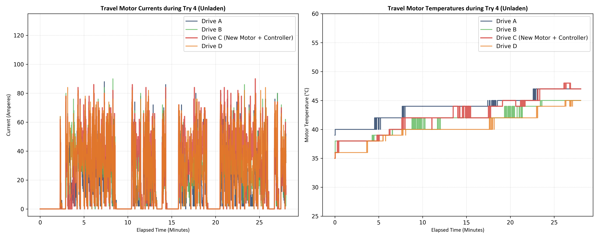
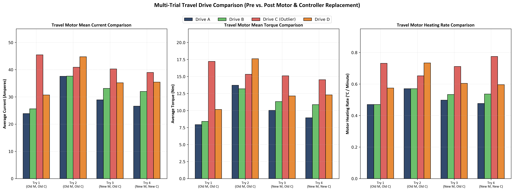
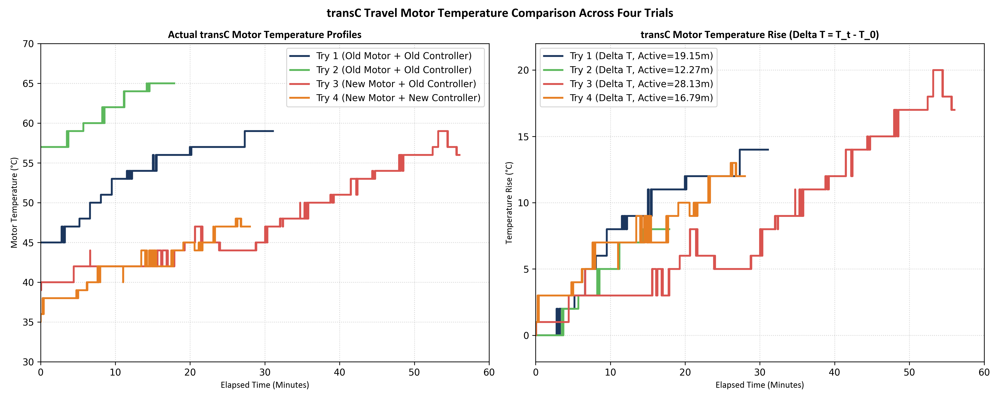

# Báo cáo Đánh giá Hiệu quả Thay thế Động cơ & Bộ điều khiển Trục C (Chạy Không Tải Lần 4)

**Mã tài liệu:** BMS-VALIDATION-TRAVEL-04  
**Dòng thiết bị:** Cổng trục di chuyển bánh lốp Isoloader MJ35  
**Cấu hình thử nghiệm:** Chạy không tải (Unladen), Bật HVAC  
**Thư mục lưu trữ:** Thư mục try4  
**Mục tiêu kiểm tra:** Xác thực hiệu năng sau khi thay mới Động cơ (Try 3) & Bộ điều khiển (Try 4) Trục di chuyển C (`transC`)

---

## 1. Tóm tắt dự án & Kết quả kiểm tra
Báo cáo này trình bày kết quả đánh giá kỹ thuật sau chuỗi hoán đổi/thay thế linh kiện trục C (`transC`).
* **Lần 3 (Try 3):** Thay mới hoàn toàn động cơ di chuyển C. Lỗi dòng cao và gia nhiệt nhanh vẫn tồn tại (dòng trung bình **40.26 A**, tốc độ gia nhiệt **0.71°C/phút**).
* **Lần 4 (Try 4):** Tiến hành thay mới hoàn toàn bộ điều khiển motor di chuyển C (Zapi controller).

Số liệu telemetry ghi nhận từ lần chạy Try 4 (tổng thời gian phiên thử 28.03 phút, thời gian di chuyển thực tế 16.79 phút) cho thấy:
* **Tình trạng lỗi vẫn KHÔNG đổi:** Động cơ C mới + controller mới vẫn tiêu thụ dòng điện cao nhất hệ thống (**38.96 A** trung bình khi di chuyển, cao hơn **25.2%** so với trung bình của 3 động cơ còn lại).
* **Tốc độ gia nhiệt vẫn ở mức cao bất thường:** Động cơ C nóng lên với tốc độ **0.774°C/phút** (nhiệt độ tăng thêm **+13.0°C** lên đỉnh **48.0°C** chỉ trong 16.79 phút), nhanh hơn đáng kể so với động cơ A (**0.477°C/phút**), động cơ B (**0.536°C/phút**) và động cơ D (**0.596°C/phút**).
* **Mô-men xoắn của trục C vẫn ở mức cao:** Mô-men xoắn thực tế của động cơ C đạt trung bình **14.52 Nm** (cao hơn **35.7%** so với trung bình các trục khác là 10.70 Nm).

**Kết luận:** Việc thay thế tuần tự cả động cơ (Try 3) và bộ điều khiển (Try 4) **hoàn toàn không** giải quyết được sự cố. Chuỗi thay thế này **chứng minh bằng số liệu thực nghiệm rằng lỗi nằm hoàn toàn ở cơ cấu cơ khí/kết cấu bên ngoài**, cụ thể là kẹt bó cụm má phanh đĩa đỗ cơ học hoặc lệch góc chụm bánh xe kết cấu gá bánh C.

---

## 2. Bảng Đối chiếu Số liệu Telemetry qua 4 Lần Chạy thử (Try 1 vs. Try 2 vs. Try 3 vs. Try 4)
Bảng dưới đây tổng hợp chi tiết các thông số đo đạc trong thời gian di chuyển chủ động (active moving) của cả 4 trục di chuyển (A, B, C, D) qua 4 lần thử nghiệm không tải.

### Bảng số liệu đối chiếu chi tiết:

| Lần chạy & Mã động cơ | Thời gian chạy | Dòng trung bình | Dòng lớn nhất | Mô-men trung bình | Mô-men lớn nhất | Nhiệt độ đầu | Nhiệt độ đỉnh | Mức tăng nhiệt | Tốc độ gia nhiệt |
| :--- | :---: | :---: | :---: | :---: | :---: | :---: | :---: | :---: | :---: |
| **Try 1 (Old M, Old C)** | **19.15 phút** | | | | | | | | |
| - Động cơ di chuyển A | | 23.86 A | 90.00 A | 7.93 Nm | 36.40 Nm | 45.0°C | 54.0°C | +9.0°C | 0.47°C/phút |
| - Động cơ di chuyển B | | 25.62 A | 86.00 A | 8.40 Nm | 34.50 Nm | 44.0°C | 53.0°C | +9.0°C | 0.47°C/phút |
| - **Động cơ di chuyển C (Lỗi)** | | **45.44 A** | **106.00 A** | **17.21 Nm** | **41.70 Nm** | **45.0°C** | **59.0°C** | **+14.0°C** | **0.73°C/phút** |
| - Động cơ di chuyển D | | 30.68 A | 86.00 A | 10.15 Nm | 35.50 Nm | 42.0°C | 53.0°C | +11.0°C | 0.57°C/phút |
| **Try 2 (Old M, Old C)** | **12.27 phút** | | | | | | | | |
| - Động cơ di chuyển A | | 37.57 A | 92.00 A | 13.70 Nm | 36.90 Nm | 53.0°C | 60.0°C | +7.0°C | 0.57°C/phút |
| - Động cơ di chuyển B | | 37.63 A | 92.00 A | 13.20 Nm | 34.90 Nm | 53.0°C | 60.0°C | +7.0°C | 0.57°C/phút |
| - **Động cơ di chuyển C (Lỗi)** | | **40.90 A** | **92.00 A** | **15.33 Nm** | **38.10 Nm** | **57.0°C** | **65.0°C** | **+8.0°C** | **0.65°C/phút** |
| - Động cơ di chuyển D | | 44.74 A | 94.00 A | 17.61 Nm | 41.60 Nm | 50.0°C | 59.0°C | +9.0°C | 0.73°C/phút |
| **Try 3 (New M, Old C)** | **28.13 phút** | | | | | | | | |
| - Động cơ di chuyển A | | 28.92 A | 88.00 A | 10.02 Nm | 36.70 Nm | 39.0°C | 53.0°C | +14.0°C | 0.50°C/phút |
| - Động cơ di chuyển B | | 33.11 A | 120.00 A | 11.31 Nm | 59.20 Nm | 38.0°C | 53.0°C | +15.0°C | 0.53°C/phút |
| - **Động cơ di chuyển C (New M)** | | **40.26 A** | **108.00 A** | **15.10 Nm** | **49.90 Nm** | **39.0°C** | **59.0°C** | **+20.0°C** | **0.71°C/phút** |
| - Động cơ di chuyển D | | 35.19 A | 88.00 A | 12.14 Nm | 35.90 Nm | 33.0°C | 50.0°C | +17.0°C | 0.60°C/phút |
| **Try 4 (New M, New C)** | **16.79 phút** | | | | | | | | |
| - Động cơ di chuyển A | | 26.59 A | 88.00 A | 8.94 Nm | 35.50 Nm | 39.0°C | 47.0°C | +8.0°C | 0.48°C/phút |
| - Động cơ di chuyển B | | 31.98 A | 90.00 A | 10.87 Nm | 35.70 Nm | 36.0°C | 45.0°C | +9.0°C | 0.54°C/phút |
| - **Động cơ di chuyển C (New M+C)**| | **38.96 A** | **90.00 A** | **14.52 Nm** | **40.70 Nm** | **35.0°C** | **48.0°C** | **+13.0°C** | **0.77°C/phút** |
| - Động cơ di chuyển D | | 35.44 A | 84.00 A | 12.29 Nm | 36.50 Nm | 35.0°C | 45.0°C | +10.0°C | 0.60°C/phút |

---

## 3. Đối chiếu Định lượng trục C với trục A, B, D (Try 4)

### 3.1 Dòng điện tiêu thụ (Amperes)
* **Trục C (38.96 A) so với Trục A (26.59 A):** Trục C cao hơn **46.5%**.
* **Trục C (38.96 A) so với Trục B (31.98 A):** Trục C cao hơn **21.8%**.
* **Trục C (38.96 A) so với Trục D (35.44 A):** Trục C cao hơn **9.9%**.

### 3.2 Mô-men xoắn phản hồi (Torque)
* **Trục C (14.52 Nm) so với Trục A (8.94 Nm):** Mô-men xoắn trục C cao hơn **62.4%**.
* **Trục C (14.52 Nm) so với Trục B (10.87 Nm):** Mô-men xoắn trục C cao hơn **33.6%**.
* **Trục C (14.52 Nm) so với Trục D (12.29 Nm):** Mô-men xoắn trục C cao hơn **18.1%**.

### 3.3 Tốc độ gia nhiệt (°C/phút)
* **Trục C (0.774°C/phút) so với Trục A (0.477°C/phút):** Trục C nóng nhanh hơn **62.3%**.
* **Trục C (0.774°C/phút) so với Trục B (0.536°C/phút):** Trục C nóng nhanh hơn **44.4%**.
* **Trục C (0.774°C/phút) so với Trục D (0.596°C/phút):** Trục C nóng nhanh hơn **29.9%**.

---

## 4. Chẩn đoán kỹ thuật & Khuyến nghị xử lý
Chuỗi thay mới Động cơ (Try 3) và Bộ điều khiển (Try 4) hoàn toàn không làm giảm dòng điện và tốc độ phát nhiệt trên trục C. Lỗi hệ thống điện đã được loại trừ. Nguyên nhân cốt lõi chắc chắn do **kết cấu cơ khí**:

### 4.1 Hiện trạng đã xác nhận
* **Áp suất thủy lực nhả phanh:** Đã đo đạc và xác nhận **bằng nhau tuyệt đối** ở cả 4 góc cẩu khi phanh mở, loại trừ việc sụt áp đường dầu mở phanh C.

### 4.2 Các nguyên nhân cơ khí còn lại
1. **Bó phanh cơ học bánh C (Mechanical Caliper Binding):** Cơ cấu má phanh hoặc piston phanh đĩa đỗ của bánh C bị kẹt cứng cơ học, không tự rút về khi có áp lực dầu (ví dụ do gãy lò xo hồi vị, kẹt ắc phanh, hoặc đĩa phanh bị cong vênh cạ vào má phanh).
2. **Sai lệch góc chụm bánh xe kết cấu (Wheel Misalignment):** Càng gá bánh xe hoặc trục lái của góc C bị lệch hướng. Bánh C bị quét lê nghiêng trên mặt đường tạo lực cản lăn lớn.
3. **Kẹt ổ bi/bạc đạn hoặc hộp số giảm tốc:** Hộp số C có ma sát cơ học cao hoặc ổ bi trục bánh xe C bị hư hỏng bó kẹt.

### 4.3 Khuyến nghị hành động tiếp theo
1. **Kích bánh xe góc C lên kiểm tra quay tự do:** Kích gầm góc C, cấp áp thủy lực nhả phanh và dùng tay quay thử bánh xe C xem có bị ghì nặng hơn bánh A/B không, đồng thời lắng nghe tiếng cạ má phanh.
2. **Kiểm tra trực tiếp cùm phanh C:** Tháo nắp cùm phanh C, kiểm tra hành trình piston phanh xem má phanh có thực sự tách khỏi đĩa phanh khi có áp suất thủy lực hay không.
3. **Đo chênh lệch góc chụm bánh xe C:** Kiểm tra thước đo hình học bánh xe C so với các bánh còn lại để xác nhận góc chụm kết cấu.

---

## 5. Đồ thị Telemetry kiểm chứng

### 5.1 Đồ thị dòng điện & nhiệt độ Try 4 (Thời gian thực)

### 5.2 Biểu đồ cột đối chiếu 4 trục qua 4 lần chạy thử

### 5.3 Biểu đồ đối chiếu gia nhiệt riêng động cơ TransC qua các lần thử

