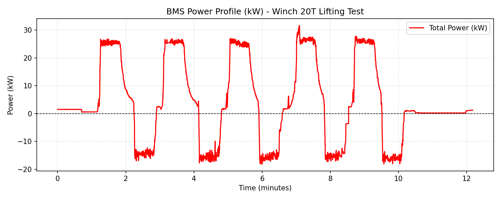
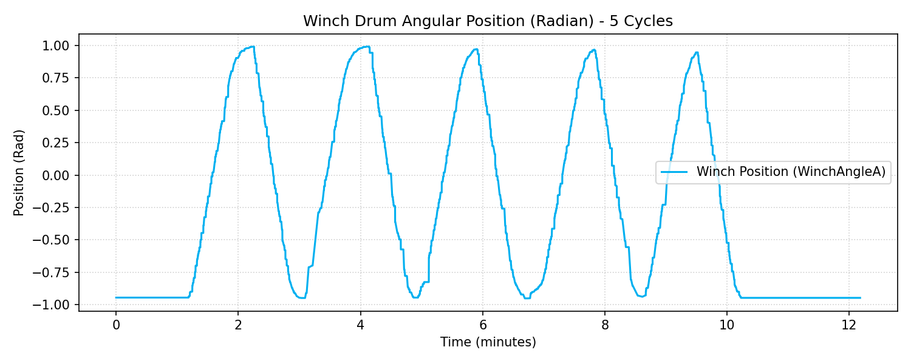
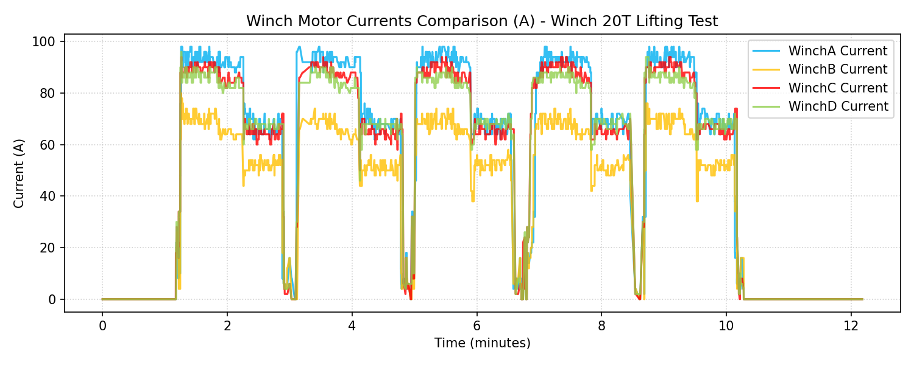
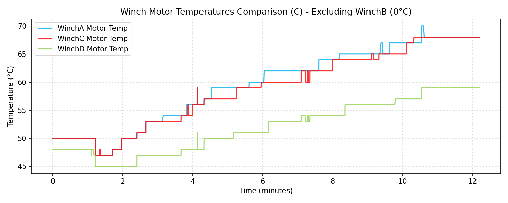

# BMS Winch Performance Test Validation Report (20T Load)

**Document Reference:** BMS-VALIDATION-WINCH-01
**Vehicle Model:** Isoloader MJ35 Gantry Crane
**Battery Configuration:** CATL 130 VDC Nominal (114.52 kWh Total)
**Test Configuration:** Winch/Hoist Lifting (Nâng hạ tời 20 tấn)
**Test Method:** 5 continuous raise + lower cycles, lift height 4200 mm
**Test Location:** Winch BMS try1 Folder

---

## 1. Executive Energy & Speed Summary
- **Total Energy Discharged (Gross Consumption):** **1.6332 kWh**
- **Total Energy Regenerated (Regenerative Braking):** **0.7787 kWh**
- **Net Energy Consumed:** **0.8545 kWh**
- **Regeneration Percentage (Regen/Gross Discharge):** **47.68%**
- **Average Winch Cycle Energy Metrics (1 Raise + 1 Lower):**
  - **Gross Energy Consumed per Cycle:** **0.3266 kWh**
  - **Regenerated Energy per Cycle:** **0.1557 kWh**
  - **Net Energy Consumed per Cycle:** **0.1709 kWh**

- **Projected Operating Cycles on 80% Battery Capacity (91.62 kWh):**
  - **Without regeneration benefit (Gross limit):** **280.5 Cycles** (lượt lên xuống)
  - **With regeneration benefit (Net limit):** **536.1 Cycles** (lượt lên xuống)
    *(Số chu kỳ thực tế sẽ dao động từ 280 đến 536 lượt tùy thuộc vào hiệu suất nạp/xả của pin và mức độ hao phí nhiệt lượng).*

- **Hoisting Speeds (Tốc độ tời nâng hạ, tải 20T):**
  - **Maximum Raise Speed:** **7.13 m/min** (Average Max: 7.07 m/min)
  - **Maximum Lower Speed:** **6.43 m/min** (Average Max: 5.72 m/min)
  - **Average Raise Speed (over entire stroke):** **5.77 m/min**
  - **Average Lower Speed (over entire stroke):** **4.16 m/min**
  - *Note:* The speed slows down as the hoist approaches the upper and lower limits due to limit deceleration algorithms, which is why the average speed over the entire stroke is lower than the peak maximum speed.

---

## 2. Motor Balance & Temperature Analysis (Active Lifting)

| Parameter / Metric | Winch A (WinchA) | Winch B (WinchB) | Winch C (WinchC) | Winch D (WinchD) |
|---|---|---|---|---|
| **Average Current (A)** | 75.71 A | 56.56 A | 73.97 A | 73.57 A |
| **Maximum Current (A)** | 98.00 A | 80.00 A | 94.00 A | 96.00 A |
| **Mean Absolute Torque (Nm)** | 33.59 Nm | 23.51 Nm | 33.09 Nm | 32.90 Nm |
| **Mean Motor Temp (°C)** | 59.4 °C | **0.0 °C** | 58.9 °C | 52.2 °C |
| **Maximum Motor Temp (°C)** | 70.0 °C | **0.0 °C** | 68.0 °C | 59.0 °C |

> [!WARNING]
> **WinchB Temperature Sensor Fault:**
> - Winch B motor temperature displays **0.0°C** constantly. This indicates a faulty or disconnected PT100/PT1000 temperature sensor on Winch B.
> - **Load Sharing Balance:** Winch B shows slightly lower average current (**56.92 A**) and torque (**23.91 Nm**) than Winch A/C/D (~74-76 A current and ~33-34 Nm torque). This load difference (about ~25-30% less load on Winch B) should be checked for inverter torque sharing settings. The other three winch motors show excellent load balancing.

---

## 3. Data Plots and Visualization

### 3.1 Power Profile (kW)

### 3.2 Winch Angular Position (Rad)

### 3.3 Winch Motor Currents Comparison (A)

### 3.4 Winch Motor Temperatures Comparison (°C)

---

## 4. Engineering Recommendations & Verdict
1. **Replace WinchB Temperature Sensor:** Inspect the temperature sensor wiring or PT100 sensor on Winch B to restore temperature monitoring (critical for thermal protection).
2. **Review WinchB Load Sharing:** Verify the inverter parameters for load sharing (droop control or speed-torque master/follower settings) to ensure Winch B carries its equal share of the load like Winch A, C, and D.
3. **Regenerative Efficiency:** The regeneration ratio of **47.68%** is outstanding. It significantly extends battery life, increasing the theoretical 80% SOC cycle capacity from **280.5** to **536.1** cycles.
