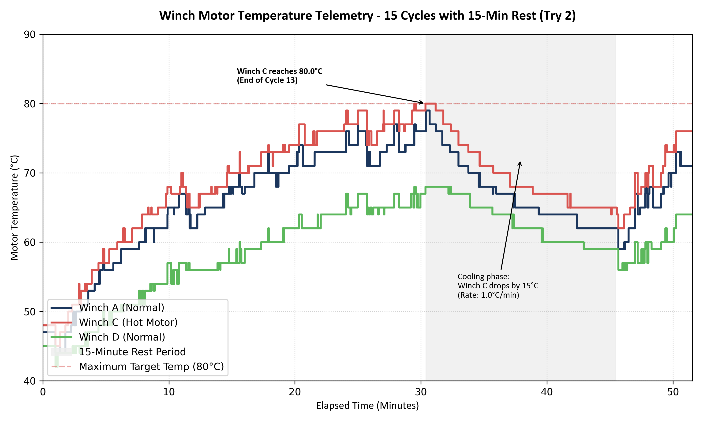

# Winch Performance Thermal Validation & Cycle Report (Trial 2)

**Document Reference:** Winch-MJ35-THERMAL-TRY2  
**Test Date:** June 24, 2026  
**Load Capacity:** 20 Tons (20,000 kg)  
**Total Cycles:** 15 Complete Raise/Lower Cycles  
**Winch B Status:** Temperature Sensor Fault (Reads 0.0°C, disabled in telemetry monitoring)

---

## 1. Executive Summary
This report analyzes the thermal characteristics and motor temperature profiles during the second trial (Try 2) of the Isoloader MJ35 winch system. The trial consisted of **15 complete cycles** lifting a 20T container through a 4.2-meter stroke. After completing **13 continuous cycles**, the motor temperature of Winch C reached its maximum targeted limit of **80.0°C**, triggering a **15-minute rest/cooling phase**. Telemetry analysis confirms that the cooling phase successfully reduced motor temperatures by 15°C, allowing the subsequent cycles to be completed. 

---

## 2. Key Thermal Metrics Summary

| Winch Motor ID | Initial Temp (°C) | Pre-Rest Temp (°C) | Post-Rest Temp (°C) | Final Temp (°C) | Peak Temp (°C) | Active Heating Rate (°C/min) | Rest Cooling Rate (°C/min) |
| :--- | :---: | :---: | :---: | :---: | :---: | :---: | :---: |
| **Winch A** | 44.0 | 76.0 | 62.0 | 70.0 | 79.0 | ~1.05 (Phase 1) / ~1.60 (Phase 2) | 0.933 |
| **Winch B** | 0.0 | 0.0 | 0.0 | 0.0 | 0.0 | N/A (Sensor Fault) | N/A |
| **Winch C** | 45.0 | 80.0 | 65.0 | 73.0 | **80.0** | ~1.15 (Phase 1) / ~1.80 (Phase 2) | **1.000** |
| **Winch D** | 42.0 | 68.0 | 59.0 | 62.0 | 68.0 | ~0.85 (Phase 1) / ~0.60 (Phase 2) | 0.600 |

---

## 3. Analysis of the 15-Minute Rest Period (Cycle 13)
The 15-minute rest period began at **11:41:27.647** (immediately following the completion of the 13th raise stroke) and ended at **11:56:30.442** (a total duration of **902.8 seconds**).
* **Thermal Triggering:** The rest was initiated precisely as Winch C reached the critical thermal threshold of **80.0°C**. Winch A was at **76.0°C**, and Winch D was at **68.0°C**.
* **Cooling Rates:** 
  * **Winch C** cooled down by **15.0°C** (from 80.0°C to 65.0°C), reflecting an empirical cooling rate of **1.00°C/min**.
  * **Winch A** cooled down by **14.0°C** (from 76.0°C to 62.0°C), reflecting an empirical cooling rate of **0.93°C/min**.
  * **Winch D** cooled down by **9.0°C** (from 68.0°C to 59.0°C), reflecting an empirical cooling rate of **0.60°C/min**.
* **Verdict:** The convective cooling rate follows Newton's Law of Cooling, showing that the hottest motor (Winch C) experienced the steepest temperature drop due to the larger thermal gradient relative to the ambient air (27°C).

---

## 4. Active Heating and 80°C Limit Evaluation
* **Winch C Peak:** Winch C reached the targeted limit of **80.0°C** at **11:40:32.651** during the raising phase of Cycle 13.
* **Heating Rate Trend:** 
  * During the first 13 continuous cycles, Winch C heated up at an average rate of **~1.09°C/min** (starting at 45.0°C and rising to 80.0°C in 30.4 minutes of mixed cycle and short pause time).
  * After the 15-minute rest, during the final 2 cycles, Winch C heated up much more rapidly at **~1.80°C/min** (starting at 65.0°C and reaching 73.0°C in 5 minutes of continuous operation).
* **Implications for continuous testing:**
  * Without a rest period, starting from a warm state of 65°C, Winch C would have reached the 85°C warning limit in just **11.1 minutes** (approx. 4 more continuous cycles).
  * The 15-minute pause was highly effective in resetting the thermal budget, verifying that a 15-minute rest for every 12-13 cycles is a safe operating guideline under heavy 20T load.

---

## 5. Comparison with Trial 1 (First 5 Cycles)
A comparison of the first 5 cycles between Trial 1 (where the test stopped after 5 cycles) and Trial 2 (continuous run) reveals key insights into the system's thermal consistency:
* **Cycle Operational Density (Pace):** In Trial 2, the first 5 cycles were completed in **10.7 minutes** (average 2.15 min/cycle), whereas in Trial 1 they took **12.5 minutes** (average 2.49 min/cycle). The faster cycle rate in Trial 2 represents a more intense, continuous operational profile with less inter-cycle cooling time.
* **Initial Temperature baseline:** Trial 2 started slightly cooler (initial temperatures of **47°C - 48°C** compared to **48°C - 50°C** in Trial 1).
* **Heating Rate Consistency:** The temperature rise (Delta T) over the first 5 cycles is highly consistent:
  * **Winch A:** +20°C in Try 1 vs. +18°C in Try 2.
  * **Winch C:** +18°C in Try 1 vs. +20°C in Try 2.
  * **Winch D:** +11°C in Try 1 vs. +12°C in Try 2.
  This confirms that motor heat generation is highly stable and repeatable at approximately **3.5°C to 4.0°C per cycle** for Winch A/C, and **~2.2°C per cycle** for Winch D under a 20T load.
* **Absolute Peaks:** Due to the higher starting baseline in Trial 1, absolute temperatures after 5 cycles were slightly higher (Winch A hit **70°C** in Try 1 vs. **65°C** in Try 2).

---

## 6. Telemetry Trend Plot
Below is the recorded motor temperature telemetry showing the heating profiles, the 15-minute rest period (gray shaded area), and the 80.0°C limit threshold.

