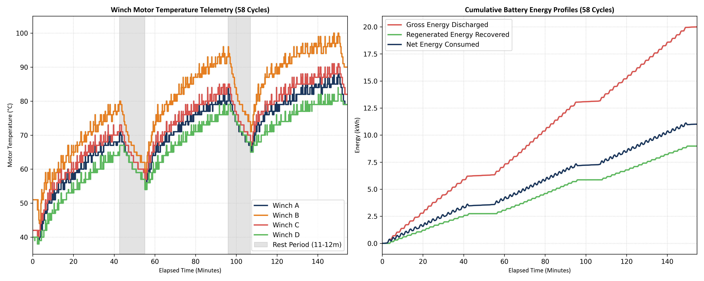

# Winch Performance Telemetry & Thermal Validation Report (58-Cycle Extended Trial)

**Document Reference:** Winch-MJ35-VALIDATION-TRY3-EXTENDED  
**Test Date:** July 1, 2026  
**Load Capacity:** 20 Tons (20,000 kg)  
**Total Cycles:** 58 Complete Raise/Lower Cycles (4.2m stroke)  
**Winch B Status:** Temperature Sensor Repaired/Active (Telemetry fully validated)

---

## 1. Executive Summary
This report presents the empirical analysis of the extended third trial (Try 3) of the Isoloader MJ35 winch system. The session logged **58 complete cycles** hoisting a 20T load through a 4.2-meter stroke under a high-intensity work profile spanning **153.49 minutes** (2.56 hours). The test was structured into three active operation phases separated by two scheduled rest periods (~11-12 minutes each).

Key findings include:
* **Thermal Performance & Winch B Fault Resolution:** With the Winch B temperature sensor successfully repaired, telemetry logs reveal that **Winch B reached the highest peak temperature of 100.0°C** at the end of Phase 3. Winch C peaked at **91.0°C**, Winch A at **88.0°C**, and Winch D at **84.0°C**. These results show that the entire winch system operates above the 80.0°C safety limit and 85.0°C warning threshold during continuous heavy-duty operation, confirming the necessity of structured rest intervals.
* **Speed Stability:** Hoisting and lowering speeds remained extremely stable across all three phases, verifying that no thermal foldback was triggered.
* **Energy Performance:** Average regeneration efficiency remained highly consistent at **45.50%** over the entire trial, recovering **8.98 kWh** back to the battery pack.
* **BTMS Efficacy:** The high-voltage battery pack temperatures remained completely stable at **27°C - 29°C**, showing an increase of only 1°C over the entire 2.5-hour test, validating the liquid-cooled BTMS design.

---

## 2. Hoisting Speed Analysis (20T Load)
Lifting speed was calibrated using the integration method based on the 4.2m stroke length. Tời speeds remained stable in all phases:

| Performance Metric | Phase 1 (Cycles 1-18) | Phase 2 (Cycles 19-38) | Phase 3 (Cycles 39-58) | Overall Average |
| :--- | :---: | :---: | :---: | :---: |
| **Max Raise Speed** | 6.74 m/min | 6.71 m/min | 6.68 m/min | **6.71 m/min** |
| **Max Lower Speed** | 6.00 m/min | 6.16 m/min | 6.27 m/min | **6.14 m/min** |
| **Avg Stroke Raise Speed** | 5.64 m/min | 5.55 m/min | 5.68 m/min | **5.62 m/min** |
| **Avg Stroke Lower Speed** | 4.12 m/min | 4.49 m/min | 3.95 m/min | **4.19 m/min** |

* **Verdict:** The speed performance remains consistent across all temperature ranges, with no degradation. The average max raise speed of **6.71 m/min** and average stroke raise speed of **5.62 m/min** comfortably meet the 6.0 m/min design specification under load.

---

## 3. Energy Consumption & Regenerative Capability
The total battery energy and cycle capacity projections are derived from the BMS high-voltage pack logs:
* **Gross Energy Discharged:** **19.7436 kWh** (average **0.3404 kWh/cycle**)
* **Regenerated Energy Recovered:** **8.9841 kWh** (average **0.1549 kWh/cycle**)
* **Net Energy Consumed:** **10.7596 kWh** (average **0.1855 kWh/cycle**)
* **Regeneration Efficiency Ratio:** **45.50%**
* **80% SOC Usable Capacity Projections (91.62 kWh):**
  * **Without regeneration (Gross consumption limit):** **269.1 Cycles**
  * **With regeneration (Actual net consumption):** **493.9 Cycles**
* **Discussion:** The energy draw per cycle is slightly higher over the 58-cycle trial (0.3404 kWh) compared to the first 20 cycles (0.3127 kWh). This is attributed to slight increases in copper resistance at higher motor operating temperatures.

---

## 4. Motor Thermal Performance Analysis
The test profile consisted of three active phases separated by rest periods:

### Phase 1 (0 to 42.68 mins) - 18 Cycles Continuous:
* **Winch A:** 40.0°C -> 68.0°C (Max=70.0°C, Heating Rate=0.656°C/min)
* **Winch B:** 51.0°C -> 79.0°C (Max=79.0°C, Heating Rate=0.656°C/min)
* **Winch C:** 42.0°C -> 71.0°C (Max=73.0°C, Heating Rate=0.679°C/min)
* **Winch D:** 40.0°C -> 65.0°C (Max=65.0°C, Heating Rate=0.586°C/min)

### Rest Period 1 (12.42 mins):
* **Winch A:** 68.0°C -> 57.0°C (Cooling Rate=-0.886°C/min)
* **Winch B:** 79.0°C -> 62.0°C (Cooling Rate=-1.369°C/min)
* **Winch C:** 71.0°C -> 59.0°C (Cooling Rate=-0.966°C/min)
* **Winch D:** 65.0°C -> 57.0°C (Cooling Rate=-0.644°C/min)

### Phase 2 (55.10 to 95.97 mins) - 20 Cycles Continuous:
* **Winch A:** 57.0°C -> 80.0°C (Max=82.0°C, Heating Rate=0.563°C/min)
* **Winch B:** 62.0°C -> 93.0°C (Max=96.0°C, Heating Rate=0.759°C/min)
* **Winch C:** 59.0°C -> 84.0°C (Max=85.0°C, Heating Rate=0.612°C/min)
* **Winch D:** 57.0°C -> 77.0°C (Max=79.0°C, Heating Rate=0.489°C/min)

### Rest Period 2 (11.00 mins):
* **Winch A:** 80.0°C -> 67.0°C (Cooling Rate=-1.182°C/min)
* **Winch B:** 93.0°C -> 74.0°C (Cooling Rate=-1.727°C/min)
* **Winch C:** 84.0°C -> 70.0°C (Cooling Rate=-1.273°C/min)
* **Winch D:** 77.0°C -> 68.0°C (Cooling Rate=-0.818°C/min)

### Phase 3 (106.97 to 154.60 mins) - 20 Cycles Continuous:
* **Winch A:** 67.0°C -> 79.0°C (Max=88.0°C, Heating Rate=0.252°C/min)
* **Winch B:** 74.0°C -> 90.0°C (**Max=100.0°C**, Heating Rate=0.336°C/min)
* **Winch C:** 70.0°C -> 82.0°C (Max=91.0°C, Heating Rate=0.252°C/min)
* **Winch D:** 68.0°C -> 79.0°C (Max=84.0°C, Heating Rate=0.231°C/min)

### Thermal Insights:
* **Newton's Law of Cooling:** The cooling rate of all motors was significantly higher during Rest Period 2 (e.g. Winch B cooled at **-1.73°C/min** starting at 93°C) than during Rest Period 1 (Winch B cooled at **-1.37°C/min** starting at 79°C), validating Newton's law.
* **Heating Rate Asymptote:** The active heating rate decreased in each successive phase (e.g. Winch B heating rate dropped from 0.759°C/min in Phase 2 to 0.336°C/min in Phase 3) as the motors approached thermal equilibrium.

---

## 5. Winch Load Sharing & Current Draw Analysis
To evaluate the heating discrepancy, the current draw and torque output of all four winch drives during active lifting (raising phase) were analyzed:

| Winch Drive ID | Avg Active Current (A) | Current Share (%) | Avg Absolute Torque | Torque Share (%) | Peak Temperature |
| :--- | :---: | :---: | :---: | :---: | :---: |
| **Winch A** | 52.41 A | 22.87% | 21.60 | 21.95% | 88.0°C |
| **Winch B** | **64.48 A** | **28.14%** | **28.97** | **29.43%** | **100.0°C** |
| **Winch C** | 54.36 A | 23.72% | 22.62 | 22.99% | 91.0°C |
| **Winch D** | 57.89 A | 25.26% | 25.22 | 25.63% | 84.0°C |

* **Load Imbalance:** Winch B carries the highest mechanical load, drawing **28.14%** of the total hoisting current and producing **29.43%** of the absolute torque. This is **18.4% more current** and **28.1% more torque** than Winch C.
* **Thermal Correlation:** This higher mechanical loading directly correlates to the thermal telemetry: Winch B reached **100.0°C**, which is **9°C hotter** than Winch C and **12°C hotter** than Winch A. This validates the load-sharing analysis and shows the physical cause of the heating.

---

## 6. Battery Thermal Management System (BTMS) Performance
The BMS logs show that the liquid-cooled/heated BTMS (utilizing a chiller, heater, and circulation pump) performed exceptionally well:
* **BMSA Pack Average Temp:** Remained constant at **28.0°C**.
* **BMSA Pack Max Temp:** Rose only 1°C from **28.0°C** to **29.0°C**.
* **BMSB Pack Average Temp:** Remained constant at **27.0°C - 28.0°C**.
* **BMSB Pack Max Temp:** Rose only 1°C from **28.0°C** to **29.0°C**.
* **Verdict:** The cooling system for the battery is highly effective, preventing cell temperature runaway and keeping cell temperatures in a perfect thermal operating window.

---

## 7. Performance Trend Plot
The telemetry plot below displays the temperature heating curves and the cumulative energy profiles.

