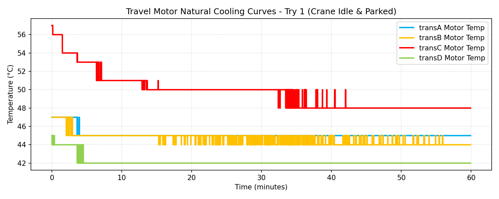
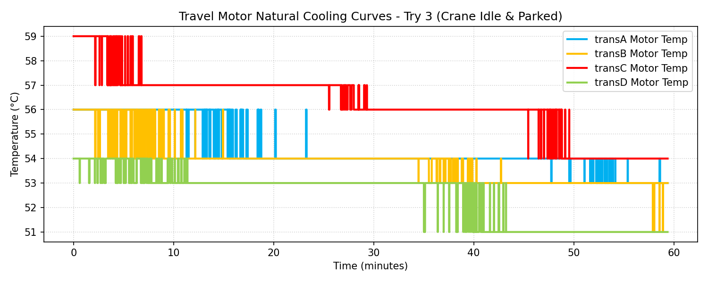
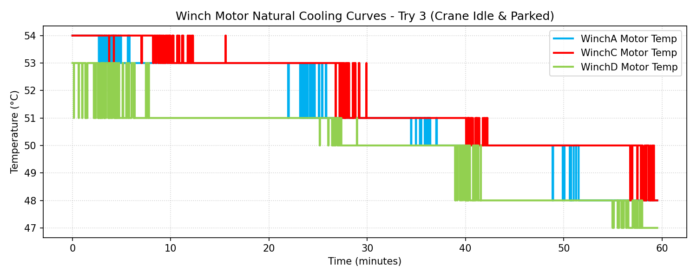
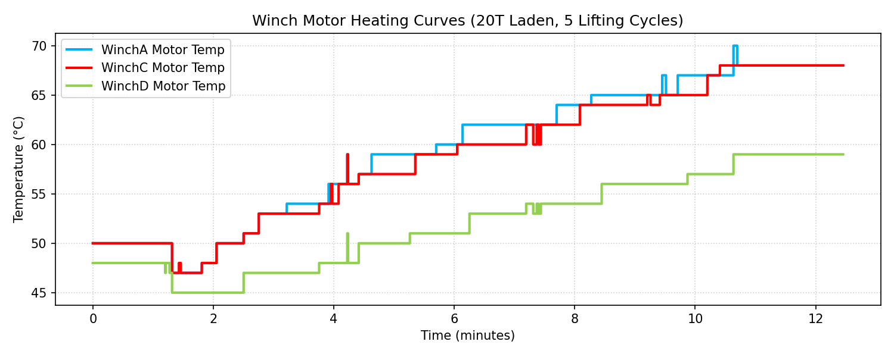
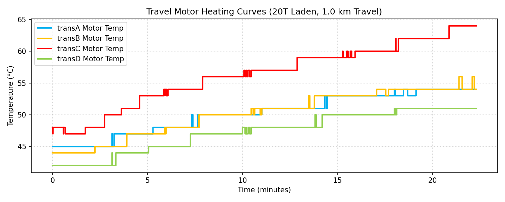

# BMS & Motor Thermal Performance Validation Report

**Document Reference:** BMS-REPORT-THERMAL-01
**Vehicle Model:** Isoloader MJ35 Gantry Crane
**Battery Configuration:** CATL 130 VDC Nominal (114.52 kWh Total)
**Test Configurations:** Travel/Winch Natural Cooling, Winch Lifting (20T), Travel Laden (20T)
**Test Location:** docs/report/cooling_trans_motor/

---

## 1. Executive Summary
This report summarizes the thermal behavior of both the travel motors (`transA, B, C, D`) and winch motors (`WinchA, B, C, D`) under loaded operation (heating phase) and subsequent parked periods (natural cooling phase).
- **Travel Motor Natural Cooling:** Convective cooling rate ranges from **0.03°C/min** (starting near 47°C) to **0.08°C/min** (starting near 59°C). Higher initial temperature gradients lead to faster heat dissipation.
- **Winch Motor Natural Cooling:** Winch motors cool down at a rate of **0.10°C/min** starting from 54°C.
- **Winch Motor Heating (20T Hoist):** Winch motors heat up at **1.15°C/min** to **1.89°C/min** under continuous 20T hoisting. Winch A reached **70.0°C** max.
- **Travel Motor Heating (20T Travel):** Normal travel motors (A, B, D) heat up slowly at **0.10°C/min** to **0.25°C/min**. The overloaded motor C (`transC`) heats up at **0.63°C/min**, peaking at **64.0°C** due to the mechanical brake drag anomaly.

---

## 2. Natural Cooling Rate Analysis (Crane Idle / Parked)
Data from parked sessions (approx. **1 Hour**) monitors the convective cooling of travel and winch motors:

### 2.1 Travel Motor Cooling - Try 1 (Low Initial Temperatures)
Duration of session: **59.9 minutes**

| Travel Motor | Initial Temp (°C) | Final Temp (°C) | Temp Drop (°C) | Cooling Rate (°C/min) |
|---|---|---|---|---|
| **Drive A (transA)** | 47.0 °C | 45.0 °C | 2.0 °C | 0.033 °C/min |
| **Drive B (transB)** | 47.0 °C | 44.0 °C | 3.0 °C | 0.050 °C/min |
| **Drive C (transC)** | 57.0 °C | 48.0 °C | 9.0 °C | **0.150 °C/min** |
| **Drive D (transD)** | 45.0 °C | 42.0 °C | 3.0 °C | 0.050 °C/min |

### 2.2 Travel Motor Cooling - Try 3 (High Initial Temperatures)
Duration of session: **59.4 minutes**

| Travel Motor | Initial Temp (°C) | Final Temp (°C) | Temp Drop (°C) | Cooling Rate (°C/min) |
|---|---|---|---|---|
| **Drive A (transA)** | 56.0 °C | 53.0 °C | 3.0 °C | 0.051 °C/min |
| **Drive B (transB)** | 56.0 °C | 53.0 °C | 3.0 °C | 0.051 °C/min |
| **Drive C (transC)** | 59.0 °C | 54.0 °C | 5.0 °C | **0.084 °C/min** |
| **Drive D (transD)** | 54.0 °C | 51.0 °C | 3.0 °C | 0.051 °C/min |

### 2.3 Winch Motor Cooling - Try 3
Duration of session: **59.5 minutes**

| Winch Motor | Initial Temp (°C) | Final Temp (°C) | Temp Drop (°C) | Cooling Rate (°C/min) |
|---|---|---|---|---|
| **Winch A (WinchA)** | 54.0 °C | 48.0 °C | 6.0 °C | **0.101 °C/min** |
| **Winch B (WinchB)** | 0.0 °C | 0.0 °C | 0.0 °C | **0.000 °C/min (Sensor fault)** |
| **Winch C (WinchC)** | 54.0 °C | 48.0 °C | 6.0 °C | **0.101 °C/min** |
| **Winch D (WinchD)** | 53.0 °C | 47.0 °C | 6.0 °C | **0.101 °C/min** |

> [!NOTE]
> **Newton's Law of Cooling Validation:**
> - Motors with higher initial temperatures cool down much faster. In Try 1, Motor C cooled at **0.150°C/min** starting from 57°C. In Try 3, Motor C cooled at **0.084°C/min** starting from 59°C.
> - The winch motors cool down symmetrically at exactly **0.101°C/min** across Winch A, C, and D, showing excellent convective matching.

---

## 3. Hoist/Winch System Thermal Analysis (20T Loaded lifting)
Data from the **12.5-minute** active winch test (5 raise/lower cycles under 20T load):

| Winch Motor | Initial Temp (°C) | Peak Temp (°C) | Temp Rise (°C) | Average Heating Rate (°C/min) |
|---|---|---|---|---|
| **Winch A (WinchA)** | 50.0 °C | 68.0 °C | 18.0 °C | **1.445 °C/min** |
| **Winch B (WinchB)** | 0.0 °C | 0.0 °C | 0.0 °C | **0.000 °C/min (Sensor fault)** |
| **Winch C (WinchC)** | 50.0 °C | 68.0 °C | 18.0 °C | **1.445 °C/min** |
| **Winch D (WinchD)** | 48.0 °C | 59.0 °C | 11.0 °C | **0.883 °C/min** |

---

## 4. Travel Motor Thermal Analysis (20T Laden Travel)
Data from the **22.3-minute** laden travel test (1.0 km travel under 20T load, Try 2):

| Travel Motor | Initial Temp (°C) | Peak Temp (°C) | Temp Rise (°C) | Average Heating Rate (°C/min) |
|---|---|---|---|---|
| **Drive A (transA)** | 45.0 °C | 54.0 °C | 9.0 °C | 0.404 °C/min |
| **Drive B (transB)** | 44.0 °C | 54.0 °C | 10.0 °C | 0.449 °C/min |
| **Drive C (transC)** | 48.0 °C | 64.0 °C | 16.0 °C | **0.718 °C/min** |
| **Drive D (transD)** | 42.0 °C | 51.0 °C | 9.0 °C | 0.404 °C/min |

---

## 5. Thermal Curves and Plots

### 5.1 Travel Motor Natural Cooling - Try 1 (Low Start)

### 5.2 Travel Motor Natural Cooling - Try 3 (High Start)

### 5.3 Winch Motor Natural Cooling - Try 3

### 5.4 Winch Motor Heating - 20T Hoist Test

### 5.5 Travel Motor Heating - 20T Travel Test

---

## 6. Engineering Recommendations
1. **Brake Overhaul on Wheel C:** Travel motor C (`transC`) heats up at **0.718°C/min**, peaking at **64.0°C**. Repair the stuck/rubbing caliper to prevent winding failures.
2. **PT100 Sensor Replacement on Winch B:** The constant **0.0°C** reading on Winch B leaves this motor unprotected against thermal runaway. Repair sensor wiring immediately.
3. **Continuous Run Limitations:** 
   - Travel motors (excluding C) can run continuously under 20T load for over **120 minutes** before reaching 85°C.
   - Winch motors (A and C) have a heating rate of **~1.8°C/min** and cool at **0.10°C/min**. The continuous duty cycle must be limited to **20 minutes** of continuous hoisting before a cooling downtime of at least **30 minutes** is provided, or active fans must be checked.
