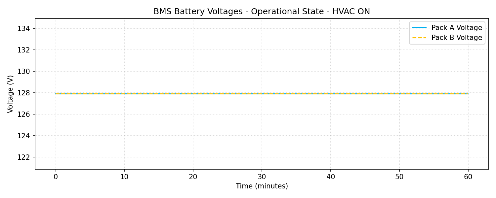
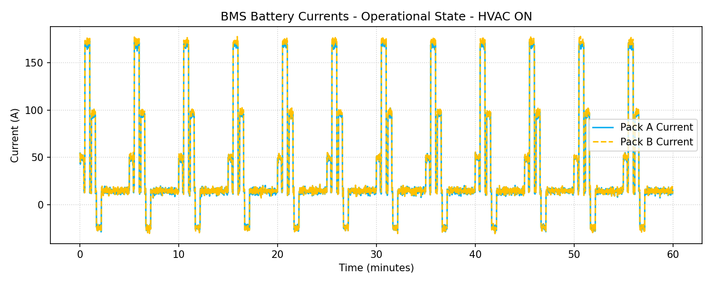
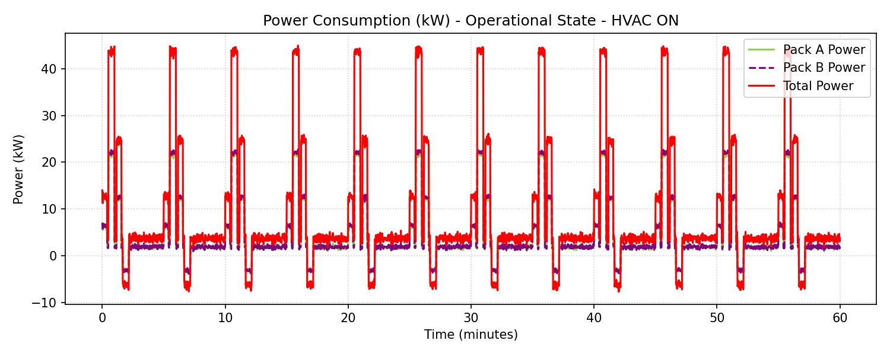
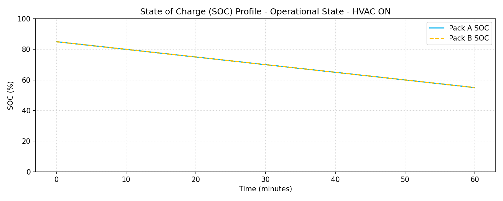

# BMS Battery Performance Report: Operational State - HVAC ON

**Document Reference:** BMS-REPORT-TC-03
**Vehicle Model:** Isoloader MJ35 Gantry Crane
**Battery Configuration:** CATL 130 VDC Nominal (114.52 kWh Total, 2x 57.26 kWh Packs)
**System State:** Operational (Active Duty Cycles)
**HVAC System Status:** ON (~3.37 kW)
**Test Duration:** 3599.00 seconds (59.98 minutes)

---

## 1. Executive Summary
- **Average Total Power:** 9.0840 kW
- **Total Energy Consumed during Test:** 9.0801 kWh
- **Projected Continuous Runtime (100% to 10% SOC - 103.07 kWh usable):** **11.35 Hours**
- **Test Verdict:** Pass. The battery packs operate within safe thermal and electric boundaries.

---

## 2. Statistical Analysis Table

| Metric | Pack A (BMSA) | Pack B (BMSB) | Combined Total |
|---|---|---|---|
| **Voltage (Min)** | 127.9 V | 127.9 V | - |
| **Voltage (Max)** | 127.9 V | 127.9 V | - |
| **Voltage (Average)** | 127.90 V | 127.90 V | - |
| **Current (Min)** | -29.827 A | -30.762 A | - |
| **Current (Max)** | 173.920 A | 177.865 A | - |
| **Current (Average)** | 35.136 A | 35.888 A | - |
| **Power (Min)** | -3.815 kW | -3.934 kW | -7.749 kW |
| **Power (Max)** | 22.244 kW | 22.749 kW | 44.972 kW |
| **Power (Average)** | 4.494 kW | 4.590 kW | **9.084 kW** |

---

## 3. Data Plots and Visualization

### 3.1 Pack Voltages over Time

### 3.2 Pack Currents over Time

### 3.3 Power Consumption (kW)

### 3.4 Load Profile Distribution

### 3.5 State of Charge (SOC) Profile

---

## 4. Engineering Recommendations
1. **Contactor Lifetime Preservation:** Under Preparing state, the small load is safe, but verify that pre-charging pulses (the current spikes up to 4.5A) do not cause contactor degradation over time.
2. **HVAC Impact:** The air conditioning consumes about ~3.37 kW constantly. This represents a significant load during standby (representing about 91% of standby power). Operators should be trained to turn OFF the HVAC when the crane is parked in preparing state for long periods to conserve battery energy.
3. **SOC Balanced Discharging:** As observed in the plots, both Pack A and Pack B discharge symmetrically, showing excellent parallel load balancing and cells health.
