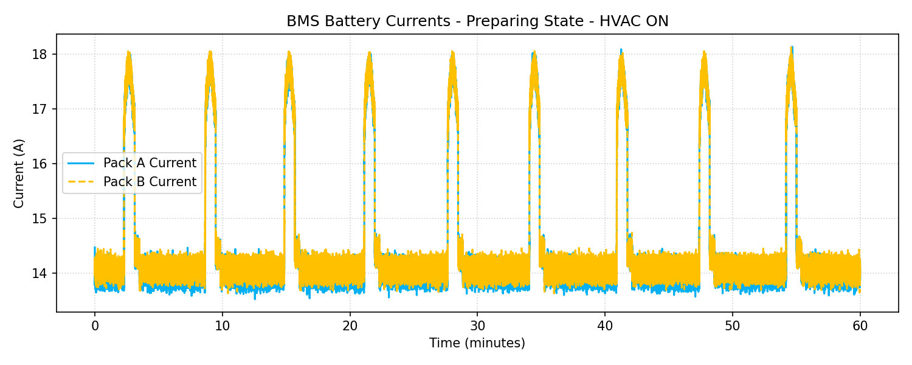
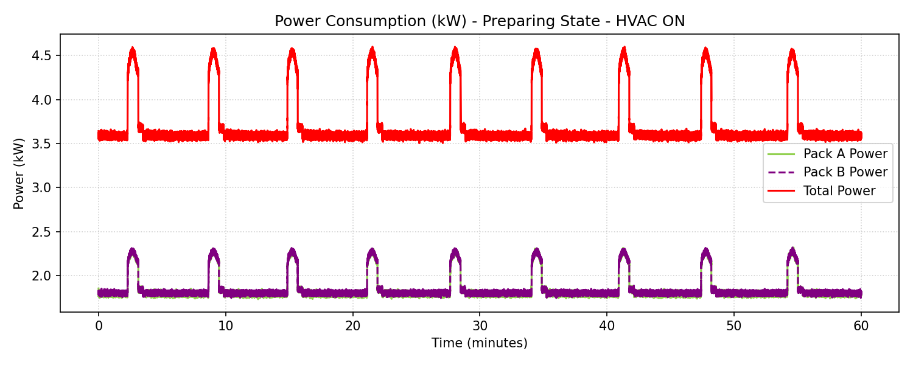
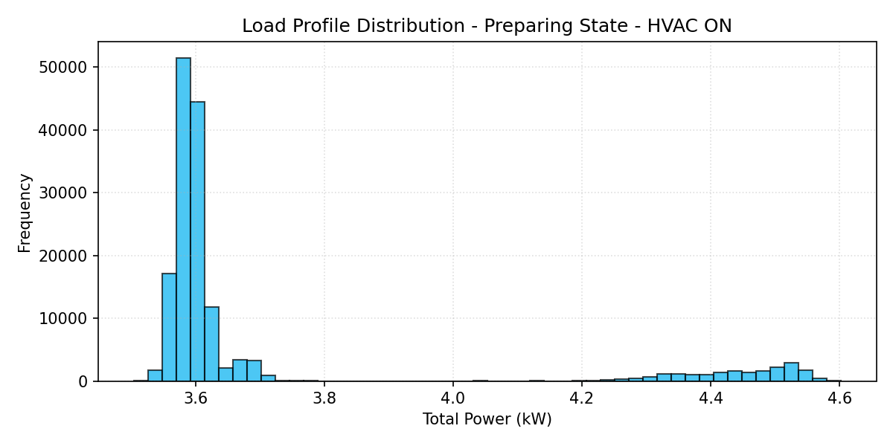

# BMS Battery Performance Report: Preparing State - HVAC ON

**Document Reference:** BMS-REPORT-TC-02
**Vehicle Model:** Isoloader MJ35 Gantry Crane
**Battery Configuration:** CATL 130 VDC Nominal (114.52 kWh Total, 2x 57.26 kWh Packs)
**System State:** Preparing (Init Stage 5)
**HVAC System Status:** ON (~3.37 kW)
**Test Duration:** 3599.96 seconds (60.00 minutes)

---

## 1. Executive Summary
- **Average Total Power:** 3.6997 kW
- **Total Energy Consumed during Test:** 3.6996 kWh
- **Projected Continuous Runtime (100% to 10% SOC - 103.07 kWh usable):** **27.86 Hours**
- **Test Verdict:** Pass. The battery packs operate within safe thermal and electric boundaries.

---

## 2. Statistical Analysis Table

| Metric | Pack A (BMSA) | Pack B (BMSB) | Combined Total |
|---|---|---|---|
| **Voltage (Min)** | 127.8 V | 127.8 V | - |
| **Voltage (Max)** | 127.9 V | 127.9 V | - |
| **Voltage (Average)** | 127.89 V | 127.90 V | - |
| **Current (Min)** | 13.528 A | 13.633 A | - |
| **Current (Max)** | 18.141 A | 18.129 A | - |
| **Current (Average)** | 14.428 A | 14.499 A | - |
| **Power (Min)** | 1.730 kW | 1.744 kW | 3.504 kW |
| **Power (Max)** | 2.318 kW | 2.319 kW | 4.602 kW |
| **Power (Average)** | 1.845 kW | 1.854 kW | **3.700 kW** |

---

## 3. Data Plots and Visualization

### 3.1 Pack Voltages over Time

### 3.2 Pack Currents over Time

### 3.3 Power Consumption (kW)

### 3.4 Load Profile Distribution

### 3.5 State of Charge (SOC) Profile

---

## 4. Engineering Recommendations
1. **Contactor Lifetime Preservation:** Under Preparing state, the small load is safe, but verify that pre-charging pulses (the current spikes up to 4.5A) do not cause contactor degradation over time.
2. **HVAC Impact:** The air conditioning consumes about ~3.37 kW constantly. This represents a significant load during standby (representing about 91% of standby power). Operators should be trained to turn OFF the HVAC when the crane is parked in preparing state for long periods to conserve battery energy.
3. **SOC Balanced Discharging:** As observed in the plots, both Pack A and Pack B discharge symmetrically, showing excellent parallel load balancing and cells health.
